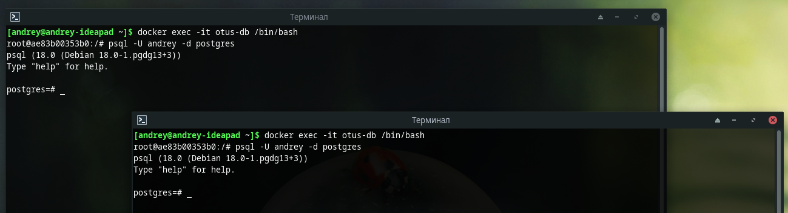
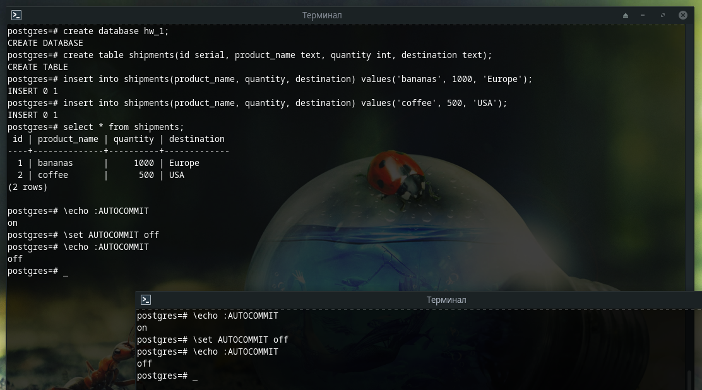
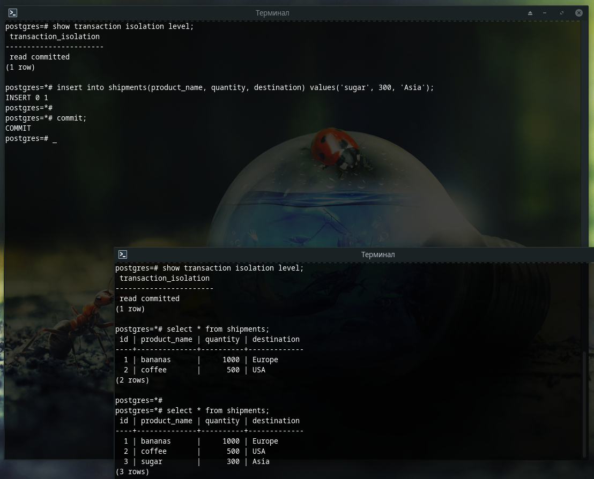
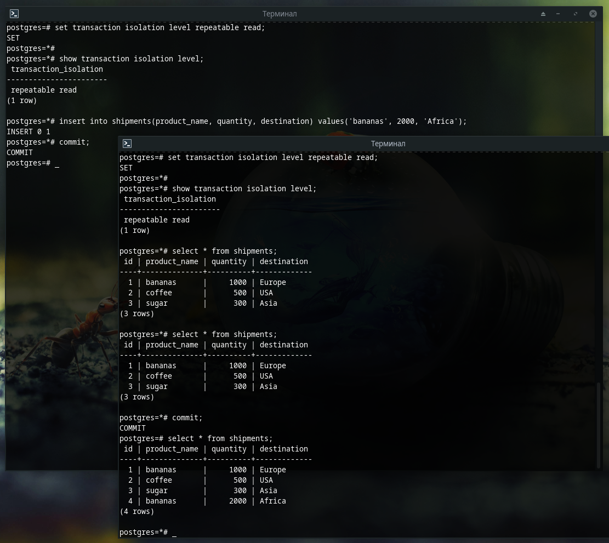

# Домашнее задание №1

### Горшков Андрей, PostgreSQL Advanced, OTUS 2025

### Подготовка:

Поднял docker контейнер с PostgreSQL 18 с помощью команды:

```bash
docker run -d -e POSTGRES_USER=andrey -e POSTGRES_PASSWORD=andrey --name otus-db -p 5432:5432 postgres:18
```

Используя `psql`  инициировал 2 сессии за суперпользователя **andrey**: 



Создал тестовую БД, добавил в неё данные и отключил **auto commit** для 1-ой и 2-ой сессии:



### Уровень изоляции Read Committed:

В 1-ой сессии инициировал **read committed** транзакцию и выполнил `insert` в таблицу `shipments`, во 2-ой сессии также начал транзакцию и выполнил `select` той же таблицы, при этом в результат запроса новая запись не попала, т.к. в 1-ой транзакции ещё не был выполнен **commit** и уровень изоляции **read committed** не позволил 2-ой транзакции прочитать "не за-commit-ченные" данные (поэтому уровень и называется **read committed**, т.к. начатая транзакция будет видеть изменения других транзакций, только если в них был **commit**).

Далее я выполнил **commit** в 1-ой транзакции и ещё раз выполнил `select` таблицы `shipments` во 2-ой транзакции, в результат запроса попали новые данные, т.к. в первой транзакции уже был выполнен **commit**.



### Уровень изоляции Repeatable read:

В 1-ой сесси я инициировал уже **read repeatable** транзакцию и выполнил `insert` в таблицу `shipments`, во 2-ой сессии также начал транзакцию и выполнил `select` той же таблицы, при этом в результат запроса новая запись не попала (аналогично **read committed**).

Далее я выполнил **commit** в 1-ой транзакции и ещё раз выполнил `select` таблицы `shipments` во 2-ой транзакции, в результат запроса новая запись всё ещё не попала, т.к. уровень изоляции **repeatable read** не даёт 2-ой транзакции прочитать новые данные, которые были добавлены после её начала (поэтому уровень и называется **repeatable read**, т.к. гарантирует "повторяемость" чтения - сколько раз бы мы не прочитали данные после начала транзакции, результат будет идентичный).

После того как я выполнил **commit** во второй транзакции и ещё раз выполнил `select` таблицы `shipments`, новые данные попали в результат `select` запроса.




