# Домашнее задание №10

### Горшков Андрей, PostgreSQL Advanced, OTUS 2025

### Подготовка:

С помощью bash скриптов [deploy_ubuntu_22.04_postgres.sh](./scripts/deploy_ubuntu_22.04_postgres.sh) и [deploy_ubuntu_22.04_clickhouse.sh](./scripts/deploy_ubuntu_22.04_clickhouse.sh), запустил 2 `docker` контейнера под PostgreSQL и ClickHouse соответственно

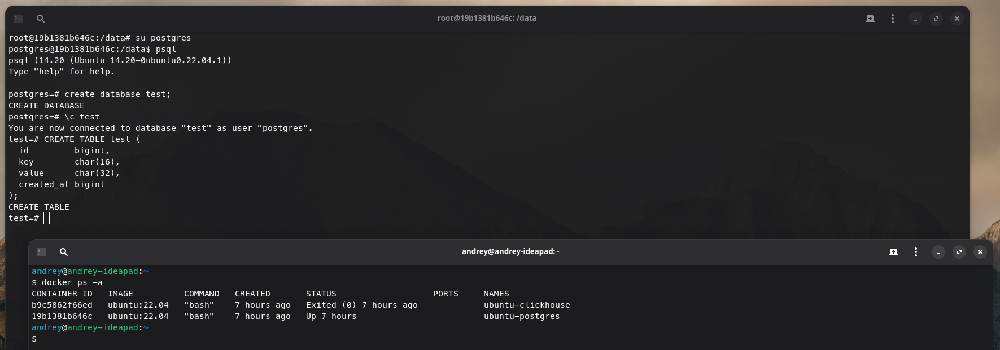

### Генерация данных

С помощью скрипта [CsvGenerator](./scripts/CsvGenerator.java) сгенерировал `csv` файл на `10GB` (примерно **146 млн. строк**) и перенёс его в `docker volume`, чтобы иметь к файлу доступ внутри `docker` контейнера:

```
javac CsvGenerator.java
java CsvGenerator test_dataset.csv 10GB
mv test_dataset.csv /var/lib/docker/volumes/ubuntu-postgres-data/_data
```

### Загрузка данных в PostgreSQL

##### Загрузка через INSERT

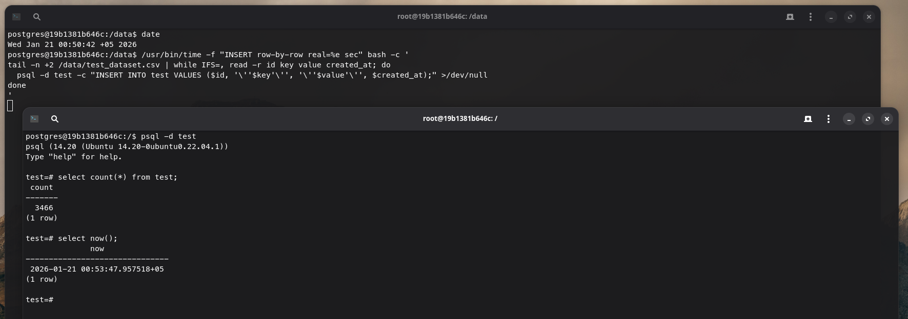

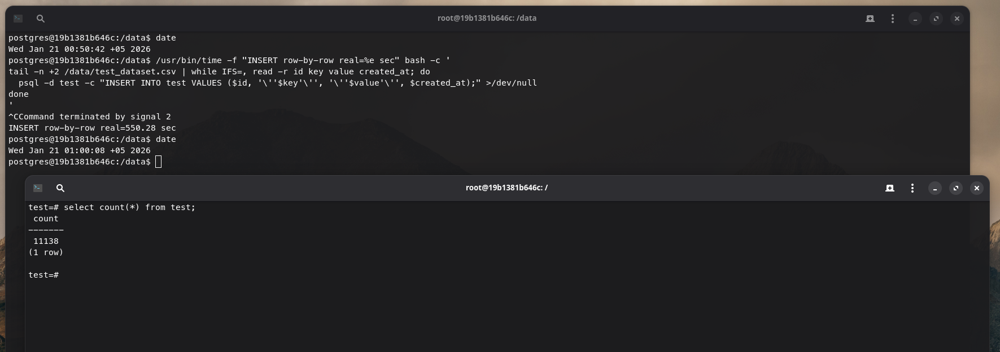

Через `INSERT`, за 10 мин., загрузилось **11138 строк из 146 млн.**, что крайне неэффективно (использовал `Linux` утилиты `time` и `tail`, для выполнения запросов построчно и измерения времени выполнения)

##### Загрузка через COPY


Через `COPY`, загрузилось все **146 млн. строк** за ~3 мин., что гораздо более эффективно

##### Загрузка через COPY + стриминг

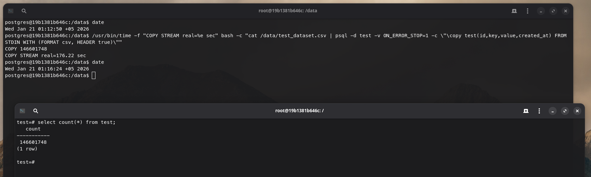

Через `COPY + стриминг` (стриминг из `STDIN` с помощью `Linux` утилиты `cat`), загрузилось все **146 млн. строк**, аналогично, за ~3 мин., что также более эффективно, чем через INSERT

##### Загрузка через COPY параллельно

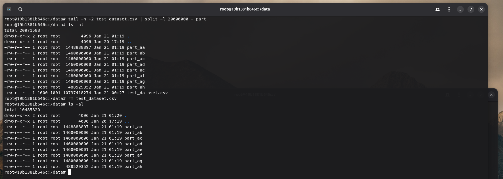

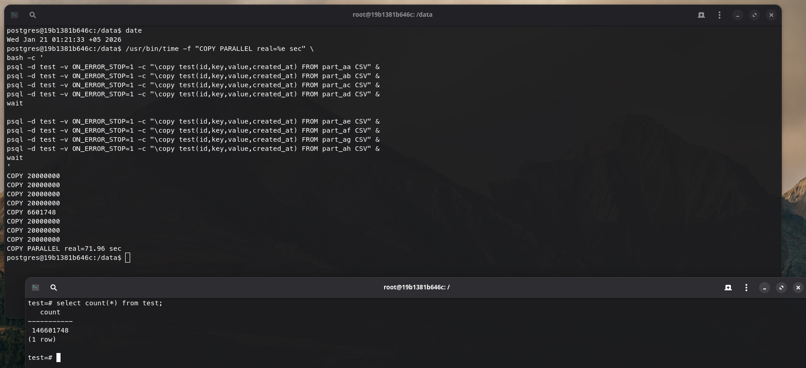

Загрузка через `COPY` параллельно, является самой эффективной, **146 млн. строк** за примерно 1 мин. (раздлелил на 7 частей, по 20 млн. строк)

##### Загрузка через pg_loader

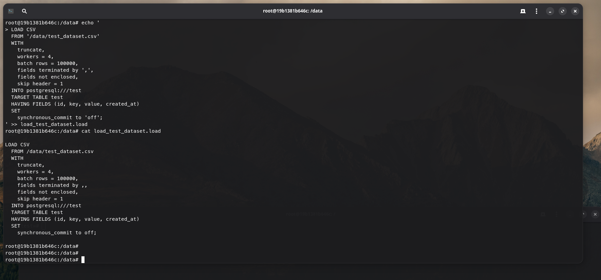

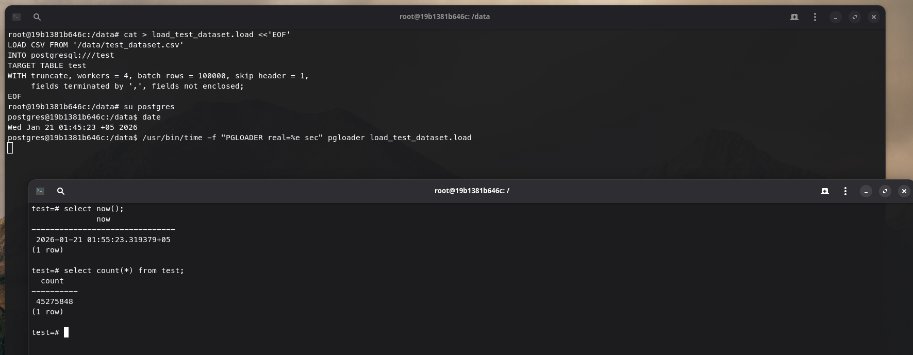

Загрузка через pg_loader, в базовой конфигурации, также показала себя не очень эффективной, **45 млн. строк** за 10 мин., способ более устойчив к "форматным" ошибкам, за счёт преобразования типов, полей и т.д., но для чистой CSV загрузки, как в моём случае, предпочтильнее использовать параллельный `COPY`

### Clickhouse

Создал пользователя `clickhouse` для последующей работы

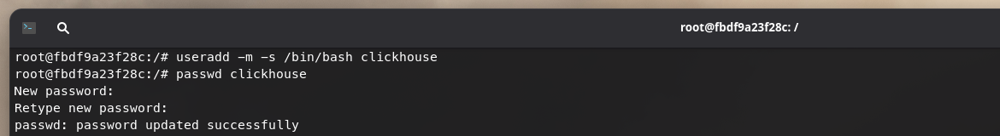

Скачал и запустил сам `clickhouse`

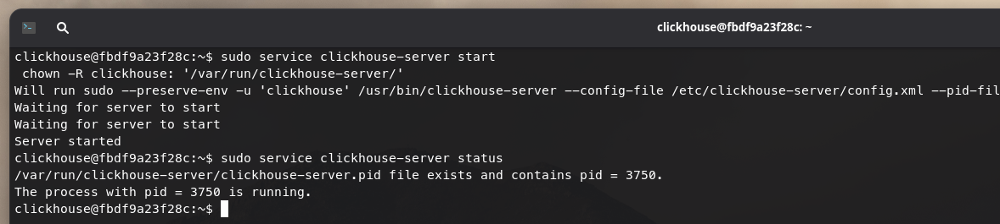

### Сравнение

Создал таблицы и загрузил в каждую из них данных на 4GB (4GB + 4GB + 4GB)

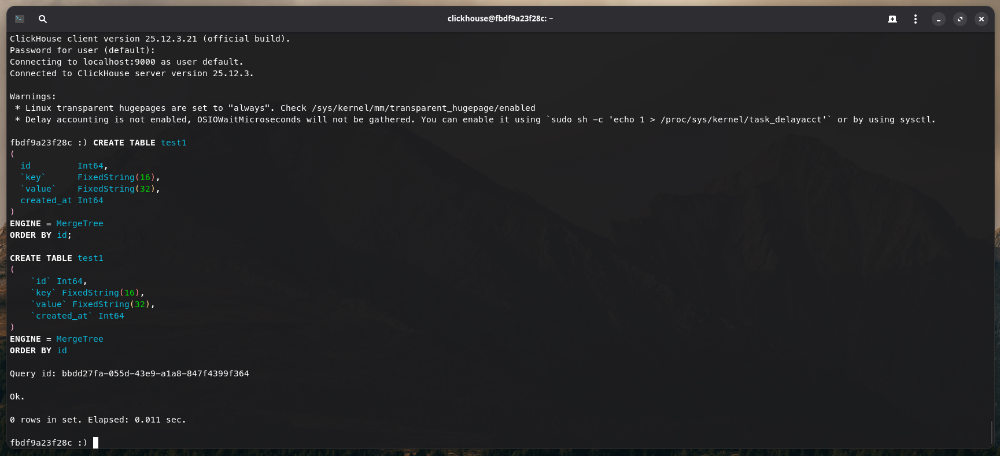

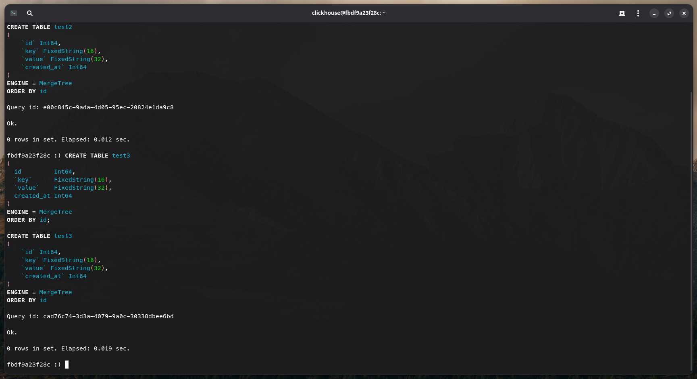

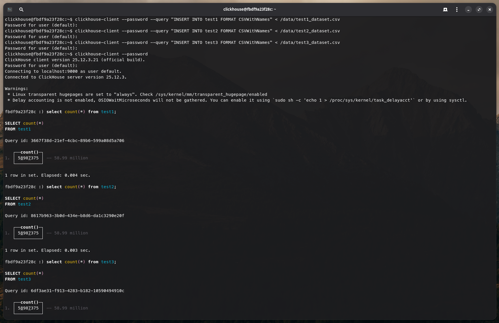

Аналогично для PostgreSQL, создал таблицы и загрузил в каждую из них те же данные

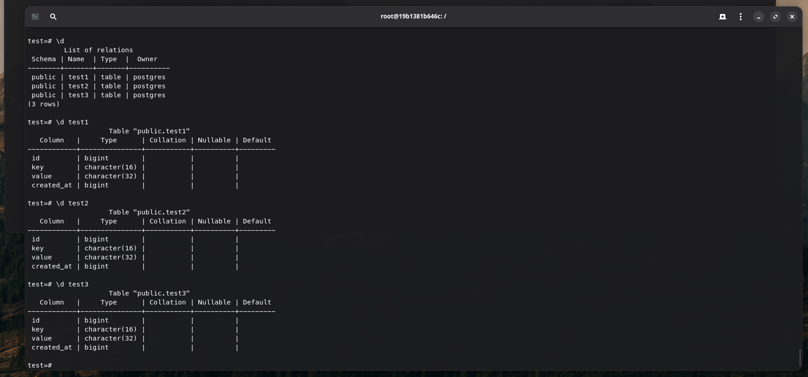

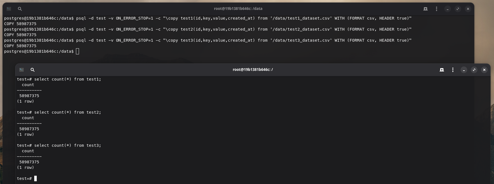

Далее запустил 3 запроса:

1. Фильтрация

```
SELECT count(*)
FROM test1
WHERE (id % 100) = 0
LIMIT 50;
```

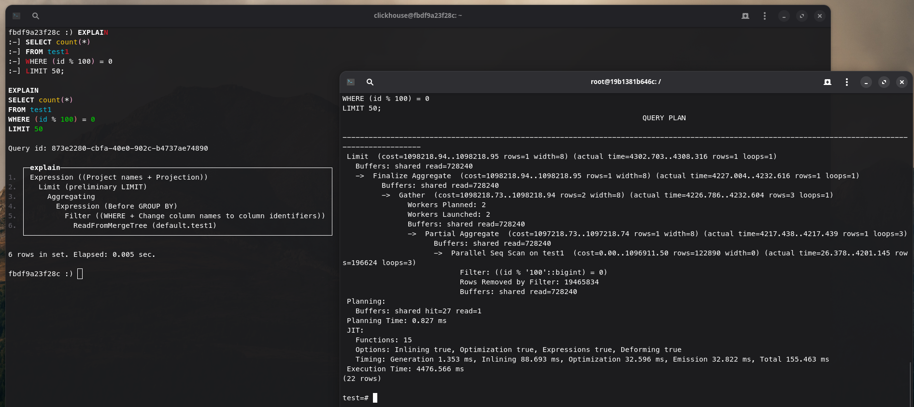

|            | Обработано данных                                     | Время      | План                                               |
|------------|-------------------------------------------------------|------------|----------------------------------------------------| 
| PostgreSQL | `shared read=728240` страниц ≈ 5.56 GB чтения с диска | 4.48 сек.  | [postgresql_plan_1](./plans/postgresql_plan_1.txt) |
| ClickHouse | 58.99 млн строк, 471.90 MB.                           | 0.126 сек. | [clickhouse_plan_1](./plans/clickhouse_plan_1.txt) |

2. Агрегация

```
SELECT
  key,
  count(*)              AS count,
  min(created_at)       AS min_ts,
  max(created_at)       AS max_ts
FROM test1
GROUP BY key
ORDER BY count DESC
LIMIT 50;
```

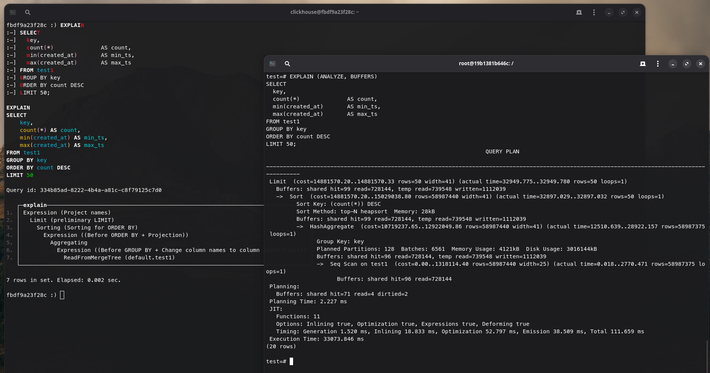

|            | Обработано данных                                     | Время      | План                                               |
|------------|-------------------------------------------------------|------------|----------------------------------------------------| 
| PostgreSQL | `shared read=728144` страниц ≈ 5.56 GB                | 33.07 сек. | [postgresql_plan_2](./plans/postgresql_plan_2.txt) |
|            | `temp read=739548` ≈ 5.64 GB (временнаые таблицы)     |            |                                                    |
|            | `temp written=1112039` ≈ 8.48 GB (временнаые таблицы) |            |                                                    |
| ClickHouse | 58.99 млн строк, 1.42 GB                              | 4.26 сек.  | [clickhouse_plan_2](./plans/clickhouse_plan_2.txt) |

3. Соединение

```
SELECT
  t1.key,
  t1.created_at,
  t2.created_at,
  t3.created_at
FROM test1 t1
JOIN test2 t2 ON t2.id = t1.id
JOIN test3 t3 ON t3.id = t1.id
LIMIT 50;
```

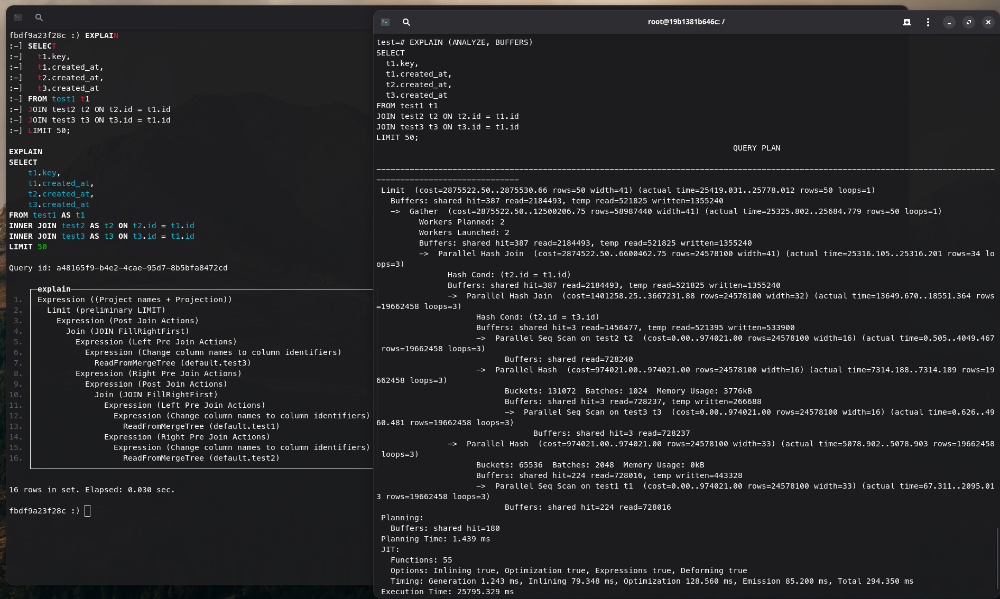

|            | Обработано данных                                     | Время      | План                                               |
|------------|-------------------------------------------------------|------------|----------------------------------------------------| 
| PostgreSQL | `shared read=2184493` страниц ≈ 16.67 GB              | 25.80 сек. | [postgresql_plan_3](./plans/postgresql_plan_3.txt) |
|            | `temp read=521825` ≈ 3.98 GB (временнаые таблицы)     |            |                                                    |
|            | `temp written=1355240` ≈ 10.34 GB (временнаые таблицы)|            |                                                    |
| ClickHouse | 122.10 млн строк, 2.90 GB                             | 4.38 сек.  | [clickhouse_plan_3](./plans/clickhouse_plan_3.txt) |

## Выводы

ClickHouse быстрее на обработке большого объема данных (миллионов строк), за счёт колоночного хранения (читаем не каждую колонку в каждой строке, а только необходимые колонки в отсортированном виде, по которым затем выбираем подходящие строки), при этом ClickHouse не лучший выбор для постоянной записи (особенно при частых, небольших `INSERT/UPDATE/DELETE`), для ClickHouse предпочтительнее "bulk" вставки данных.

ClickHouse стоит использовать для OLAP‑сценариев (аналитика, отчёты, какие-то realtime показатели), PostgreSQL больше подойдёт для OLTP‑сценариев, там где необходимы ACID транзакции, блокировки, гибкость операций.
