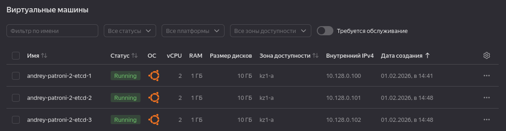
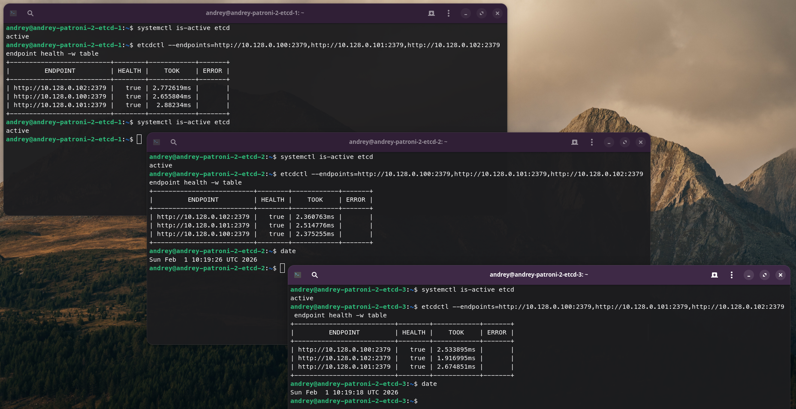
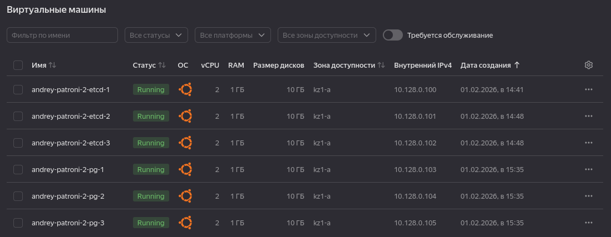
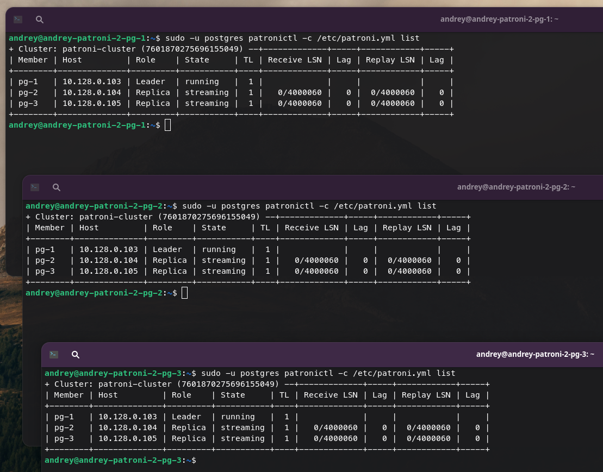
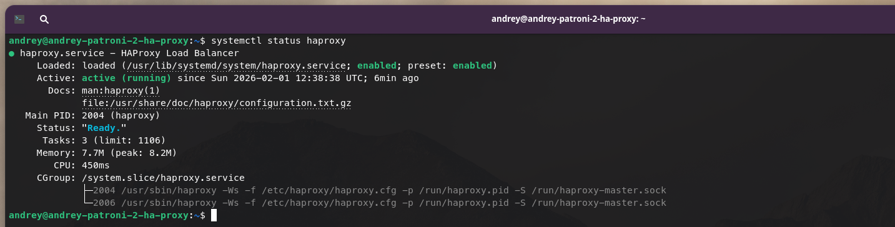
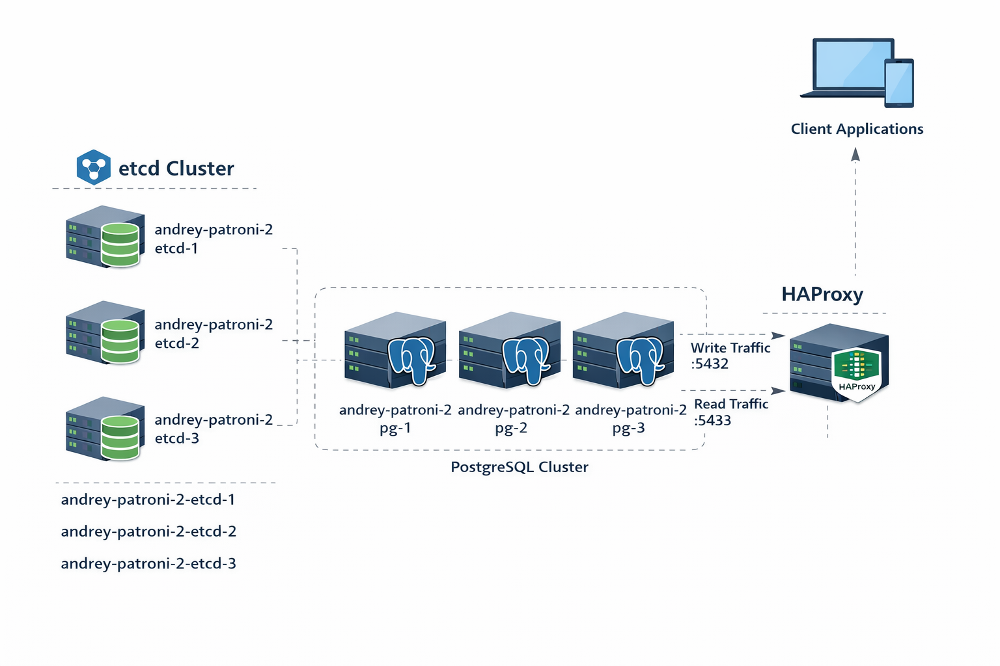

# Домашнее задание №11

### Горшков Андрей, PostgreSQL Advanced, OTUS 2025

1. **ETCD**, создал 3 ВМ и настроил на каждой из ВМ etcd, используя конфигурационные файлы и [etcd.service](./scripts/etcd/etcd.service) файл для запуска etcd, как системной службы:

| Имя                     | IP           | Конфиг. файл                    |
|-------------------------|--------------|---------------------------------|
| andrey-patroni-2-etcd-1 | 10.128.0.100 | [etcd-1](./scripts/etcd/etcd-1) |
| andrey-patroni-2-etcd-2 | 10.128.0.101 | [etcd-2](./scripts/etcd/etcd-2) |
| andrey-patroni-2-etcd-3 | 10.128.0.102 | [etcd-3](./scripts/etcd/etcd-3) |

2. **Patroni**, создал 3 ВМ и настроил на каждой из ВМ PostgreSQL и patroni, используя конфигурационные файлы и [patroni.service](./scripts/patroni/patroni.service) файл для запуска patroni, как системной службы:

| Имя                   | IP           | Конфиг. файл                                     |
|-----------------------|--------------|--------------------------------------------------|
| andrey-patroni-2-pg-1 | 10.128.0.103 | [patroni-1.yml](./scripts/patroni/patroni-1.yml) |
| andrey-patroni-2-pg-2 | 10.128.0.104 | [patroni-2.yml](./scripts/patroni/patroni-2.yml) |
| andrey-patroni-2-pg-3 | 10.128.0.105 | [patroni-3.yml](./scripts/patroni/patroni-3.yml) |

3. **HAProxy**, создал ВМ и настроил haproxy, используя конфигурационный файл [haproxy.cfg](./scripts/haproxy/haproxy.cfg)

Далее "failover", остановив ВМ `andrey-patroni-2-pg-1`, которая на данный момент - leader (patroni переключил leader-а на `andrey-patroni-2-pg-2`):

[Демонстрация "failover" (видео)](./screenshots/failover.mp4)

Архитектура решения:

