# Домашнее задание №12

### Горшков Андрей, PostgreSQL Advanced, OTUS 2025

Создал 4 ВМ в Yandex Cloud, 3 под **CockroachDB** кластер из 3-х нод, 1 под **PostgreSQL** single-нод:

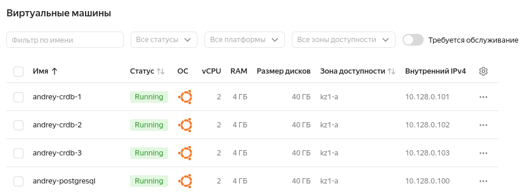

| Имя                     | Внутренний IP | CPU | RAM |
|-------------------------|---------------|-----|-----|
| andrey-postgresql       | 10.128.0.100  | 2   | 4GB |
| andrey-crdb-1   | 10.128.0.101  | 2   | 4GB |
| andrey-crdb-2   | 10.128.0.102  | 2   | 4GB |
| andrey-crdb-3   | 10.128.0.103  | 2   | 4GB |

#### CockroachDB кластер

На каждой из нод, поднял **CockroachDB**, используя [crdb.service](./scripts/crdb) файлы для запуска **CockroachDB**, как системной службы (поднять геораспределнный кластер - нет получается, т.к. Yandex Clouad даёт выбрать только зону доступности **kz1-а**):

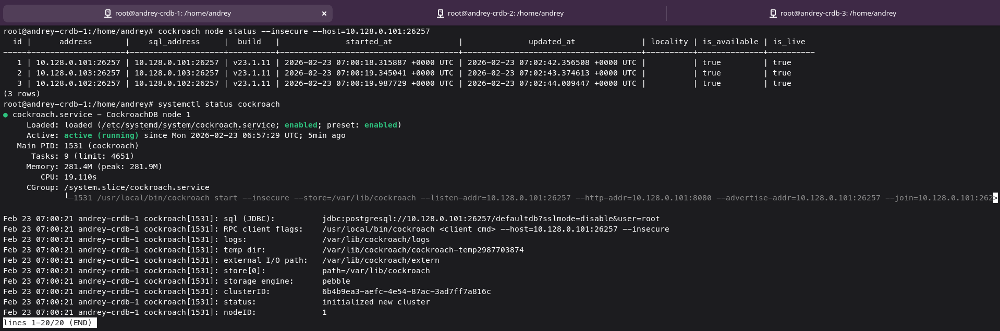

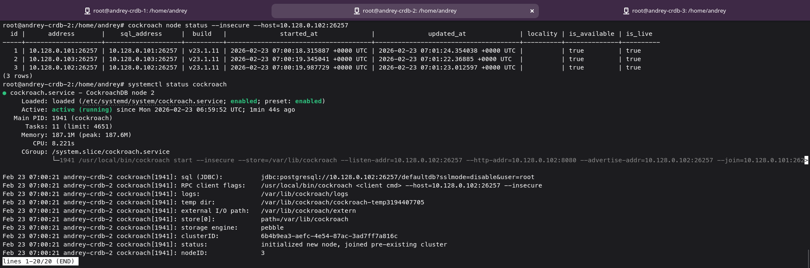

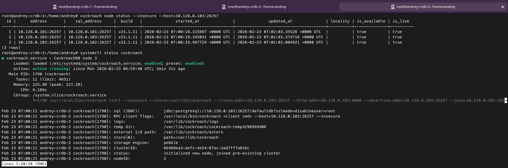

Проинициализировал кластер, убедился в его работоспособности, выполнил запись с каждой из нод, убедился в работоспособности репликации (multimaster):

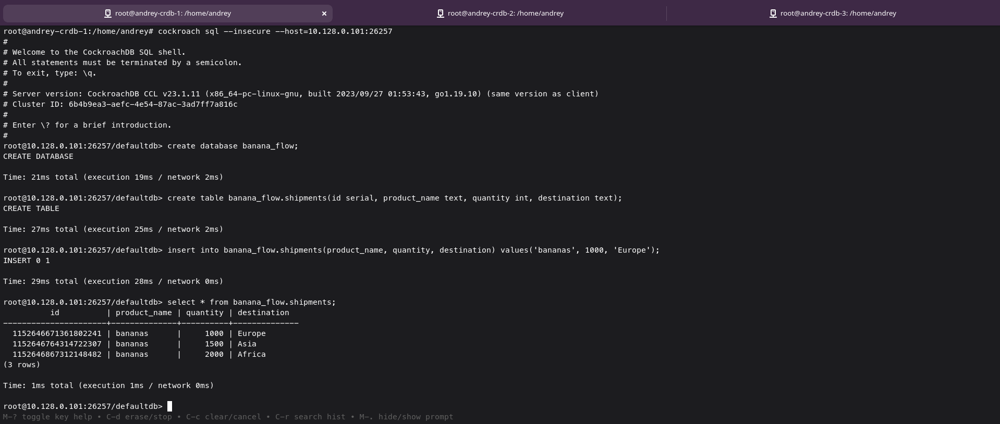

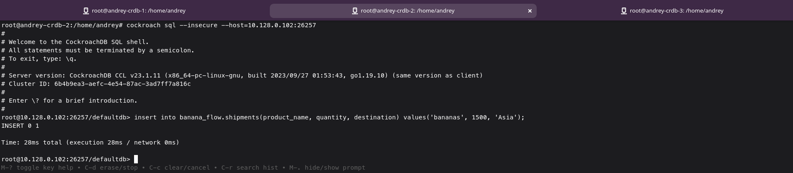

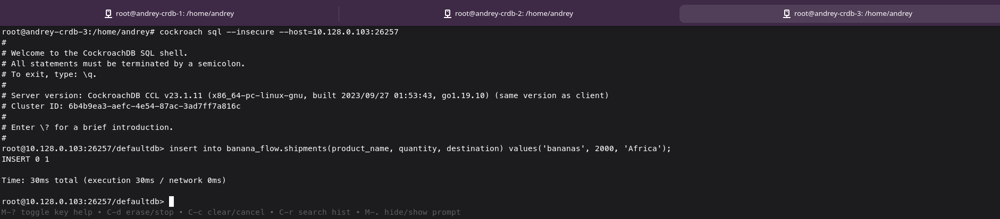

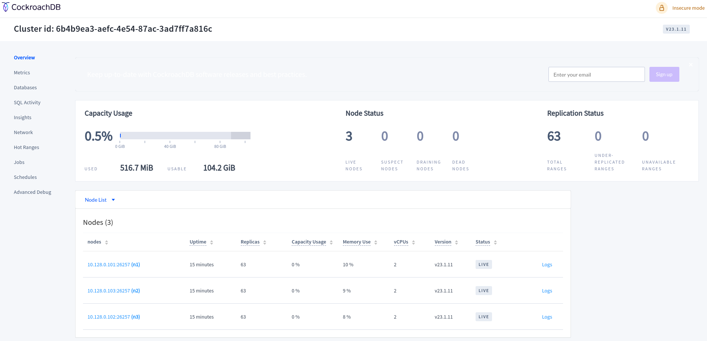

Сгенерировал набор данных для последующего бенчмарка с помощью `cockroach workload`, набор данных - ~12GB:

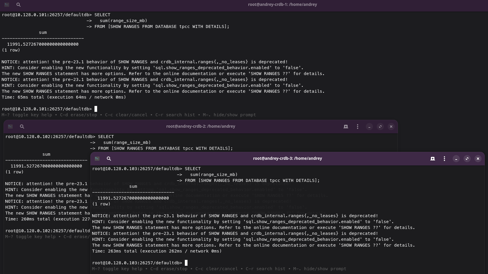

Запустил бенчмарк с помощью `cockroach workload` на 3 мин.:

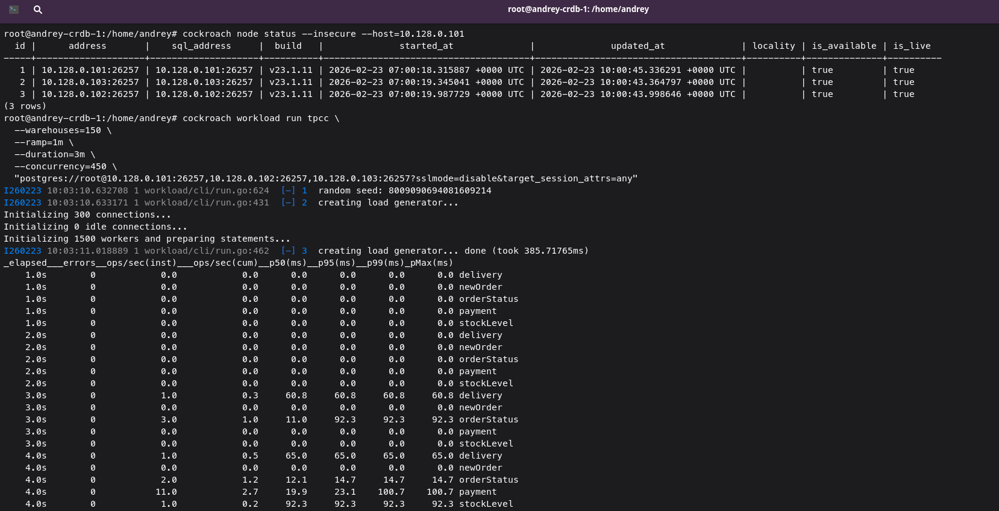

Результат:

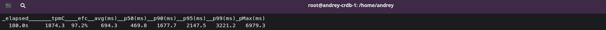

#### PostgreSQL

Поднял **PostgreSQL** single ноду, аналогично **CockroachDB**, сгенерировал набор данных для последующего бенчмарка с помощью `HammerDB` - ~16GB (получилось чуть больше, из-за различий `cockroach workload` и `HammerDB`), использовал файл [build.tcl](./scripts/pg/hammer-db-build.tcl):

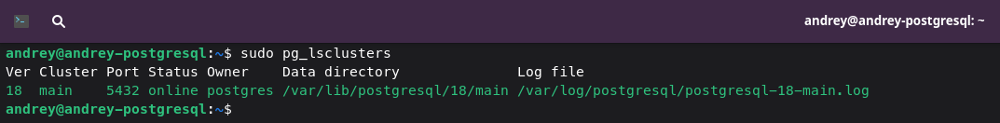

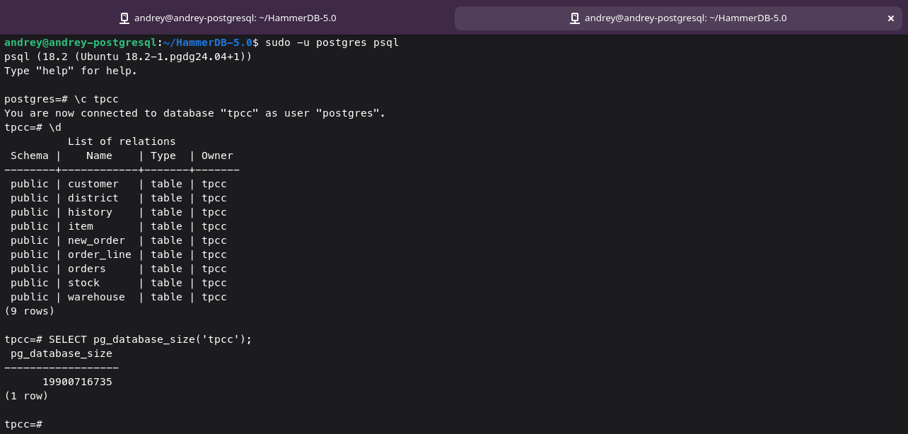

Аналогично запустил бенчмарк с помощью `HammerDB` на 3 мин. (`HammerDB` использовал чтобы создать профиль нагрузки, похожий, на профиль нагрузки, что создаёт `cockroach workload`, т.к. `pgbench`, например генерирует TPC-B нагрузку, более упрощенную (4 таблиц vs 9 таблиц, нет join-ов и т.п.), `cockroach workload` генерирует TPC-C), использовал файл [run.tcl](./scripts/pg/hammer-db-run.tcl):

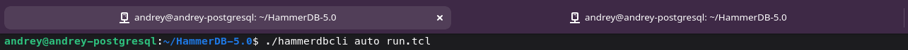

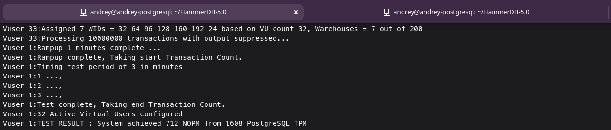

#### Выводы

**CockroachDB** показал ~1874 TPM при 97.2% успешных транзакций и среднем времени 694 мс (p95 ≈ 2147 мс), тогда как **PostgreSQL** на чуть большем объёме данных дал ~1608 TPM; если грубо сопоставлять TPM, **CockroachDB** выдаёт больше транзакций в минуту, но при заметно высокой латентности "хвостов" (p99 > 3.2 сек, pMax почти 7 сек, p - перцентиль), из-за распределённой архитектуры и межнодовой координации (multimaster). PostgreSQL проще по архитектуре, но упирается в диск и ресурсы ВМ; **CockroachDB** масштабируется и лучше подходит для распределённых и отказоустойчивых систем, тогда как **PostgreSQL** эффективнее и проще для single ноды OLTP. При абсолютно таком же наборе данных и абсолютно такой же нагрузке, **PostgreSQL**, выйграет по производительности, но проиграет по отказоустойчивости.
