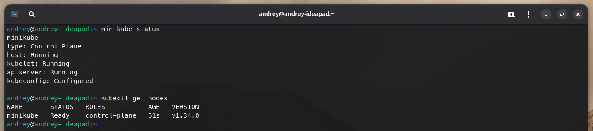
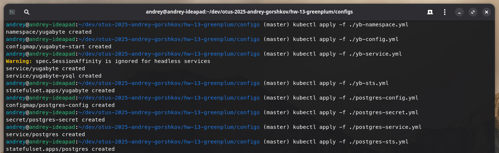
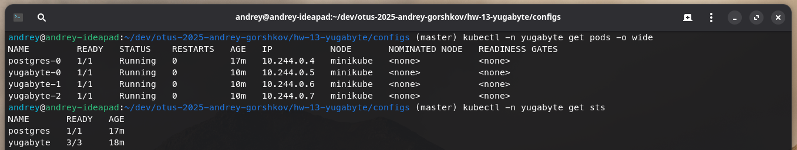
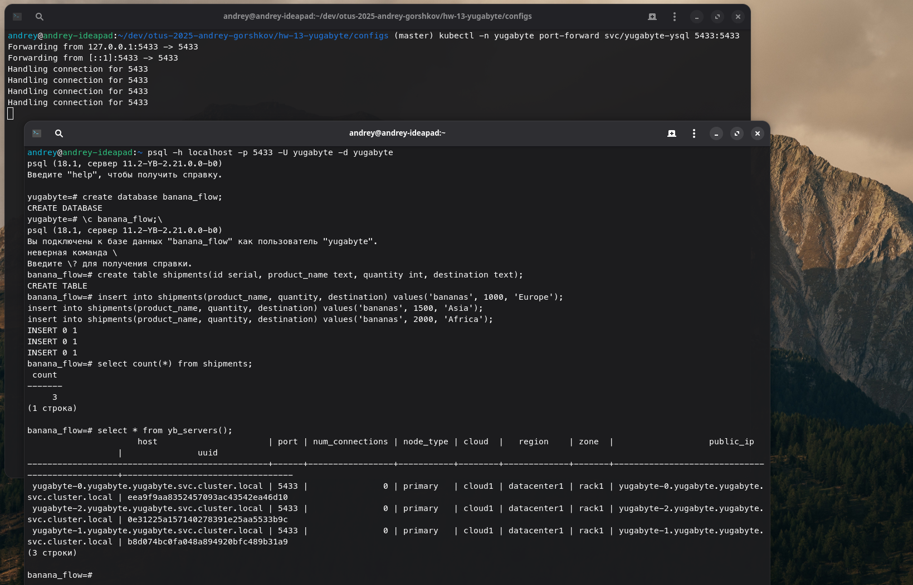
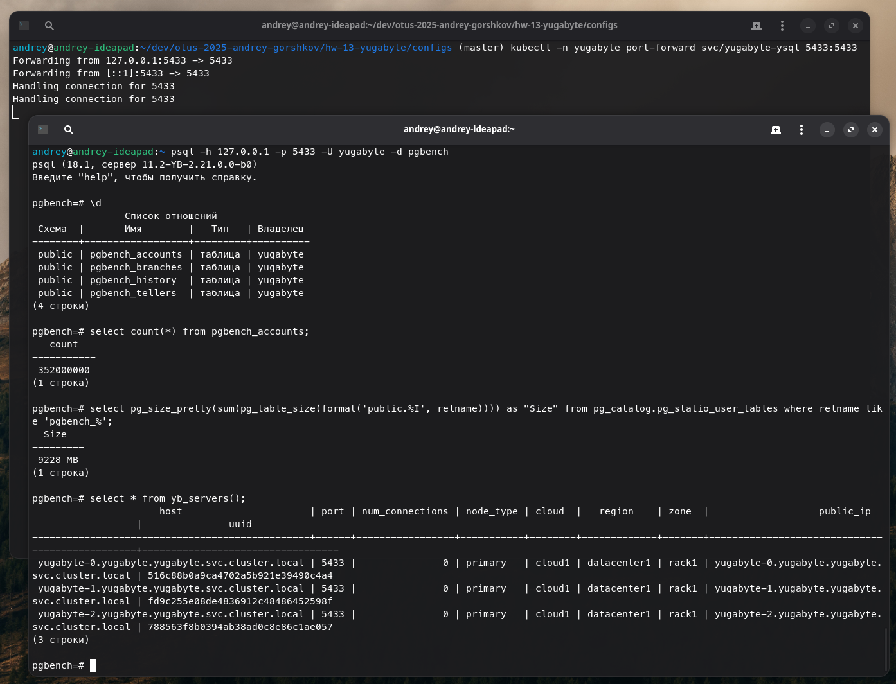
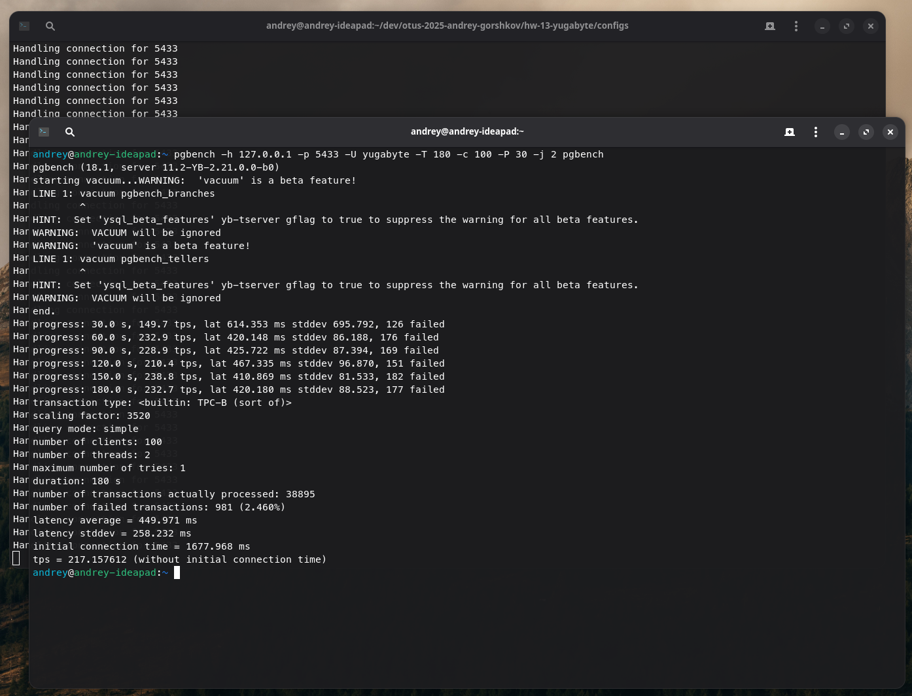
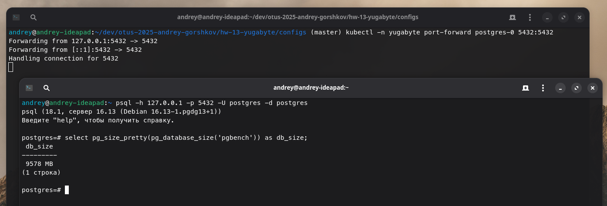
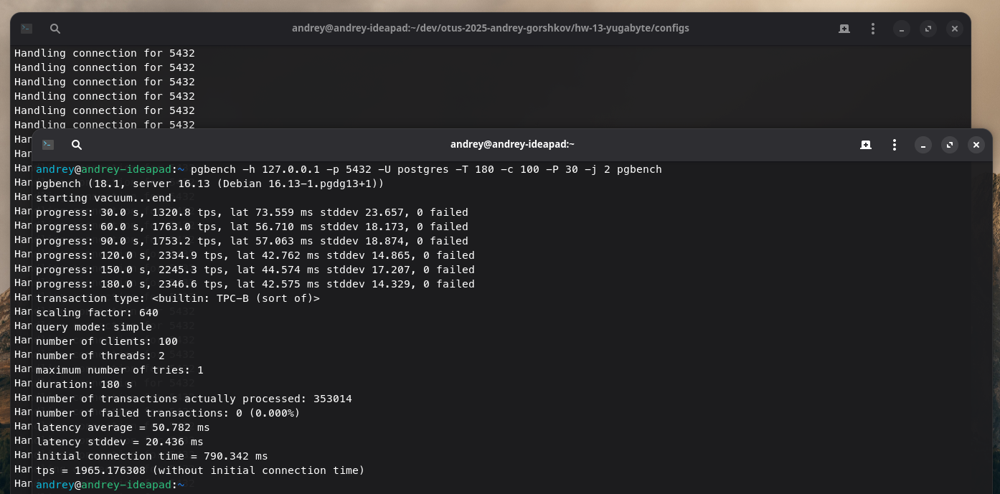

# Домашнее задание №13

### Горшков Андрей, PostgreSQL Advanced, OTUS 2025

### Подготовка:

Поднял `YugabyteDB` кластер из 3-х нод (pod-ов) и single `PostgreSQL` в `minikube`, используя файлы [configs](./configs/):







### Манифесты ([configs](./configs/))

- Namespace: [configs/yb-namespace.yml](./configs/yb-namespace.yml)
- YugabyteDB ConfigMap (скрипт для запуска): [configs/yb-config.yml](./configs/yb-config.yml)
- YugabyteDB Service: [configs/yb-service.yml](./configs/yb-service.yml)
- YugabyteDB StatefulSet (3 pod-а): [configs/yb-sts.yml](./configs/yb-sts.yml)
- PostgreSQL ConfigMap: [configs/postgres-config.yml](./configs/postgres-config.yml)
- PostgreSQL Secret: [configs/postgres-secret.yml](./configs/postgres-secret.yml)
- PostgreSQL Service: [configs/postgres-service.yml](./configs/postgres-service.yml)
- PostgreSQL StatefulSet: [configs/postgres-sts.yml](./configs/postgres-sts.yml)

Убедился, что `YugabyteDB` кластер "живой" (запущены 3 pod-а, каждый pod в состоянии `Running`), в `PostgreSQL` запущен один pod в состоянии `Running`



### YugabyteDB кластер

Через `port-forward` и `pgbench`, сгенерировал данных на ~10GB (`-s 640`):

```bash
kubectl -n yugabyte port-forward svc/yugabyte-ysql 5433:5433
createdb -h 127.0.0.1 -p 5433 -U yugabyte pgbench
pgbench -h 127.0.0.1 -p 5433 -U yugabyte -i -s 640 pgbench
```



P.S. При генерации данных большого объема кластер падал из‑за OOM: в `kubectl describe pod` видно `OOMKilled` и `Exit Code: 137`, проблему решил генерацией данных по частям (chunk-ами)

Далее, через `pgbench` сгенерировал нагрузку:

```bash
pgbench -h 127.0.0.1 -p 5433 -U yugabyte -T 180 -c 100 -P 30 -j 2 pgbench
```



Результат:

| Параметр | Значение |
| --- | --- |
| TPS | 217.16 |
| Latency avg, ms | 449.971 |
| Latency stddev, ms | 258.232 |
| Failed, txn | 981 (2.46%) |
| Initial connection time, ms | 1677.968 |

### PostgreSQL single

Аналогично, через `port-forward` и `pgbench`, сгенерировал данных на ~10GB (`-s 640`):



```bash
kubectl -n yugabyte port-forward svc/postgres 5432:5432
createdb -h 127.0.0.1 -p 5432 -U postgres pgbench
pgbench -h 127.0.0.1 -p 5432 -U postgres -i -s 640 pgbench
```

Далее, аналогично, через `pgbench` сгенерировал нагрузку:

```bash
pgbench -h 127.0.0.1 -p 5432 -U postgres -T 180 -c 100 -P 30 -j 2 pgbench
```



Результат:

| Параметр | Значение |
| --- | --- |
| TPS | 1965.176 |
| Latency avg, ms | 50.782 |
| Latency stddev, ms | 20.436 |
| Failed, txn | 0 (0.000%) |
| Initial connection time, ms | 790.342 |

### Выводы

| Параметр | YugabyteDB (3 pod-а) | PostgreSQL (1 pod) |
| --- | --- | --- |
| TPS | 217.16 | 1965.176 |
| Latency avg, ms | 449.971 | 50.782 |
| Failed, txn | 981 (2.46%) | 0 (0.000%) |
| Initial connection time, ms | 1677.968 | 790.342 |

**YugabyteDB** показал ~217 TPS успешных транзакций и среднюю задержку ~450 ms, тогда как **PostgreSQL** на том же объёме данных дал ~1965 TPS и ~51 ms; если грубо сопоставлять TPS, **PostgreSQL** существенно выигрывает по производительности, но **YugabyteDB**, как и ожидалось, медленнее из‑за распределённой архитектуры и межнодовой координации. **PostgreSQL** проще в эксплуатации и эффективнее для single-ноды OLTP, но проигрывает **YugabyteDB**, в отказоустойчивости и масштабировании. **YugabyteDB** более эффективен как в распределённые и отказоустойчивые системы, где можно пойти на компромисс по производительности.
