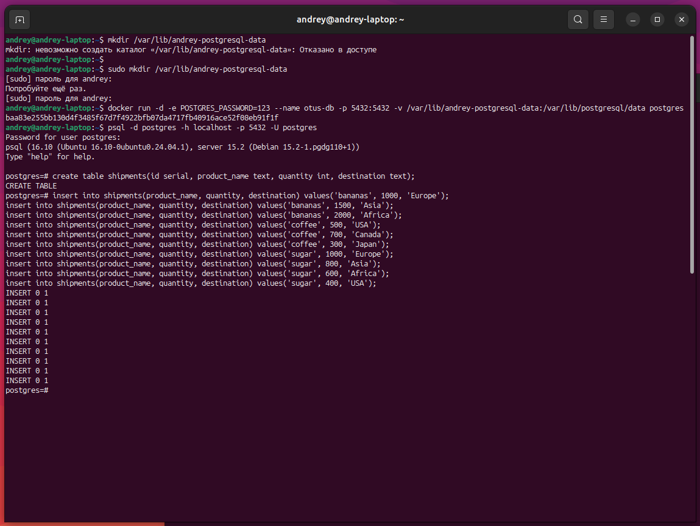
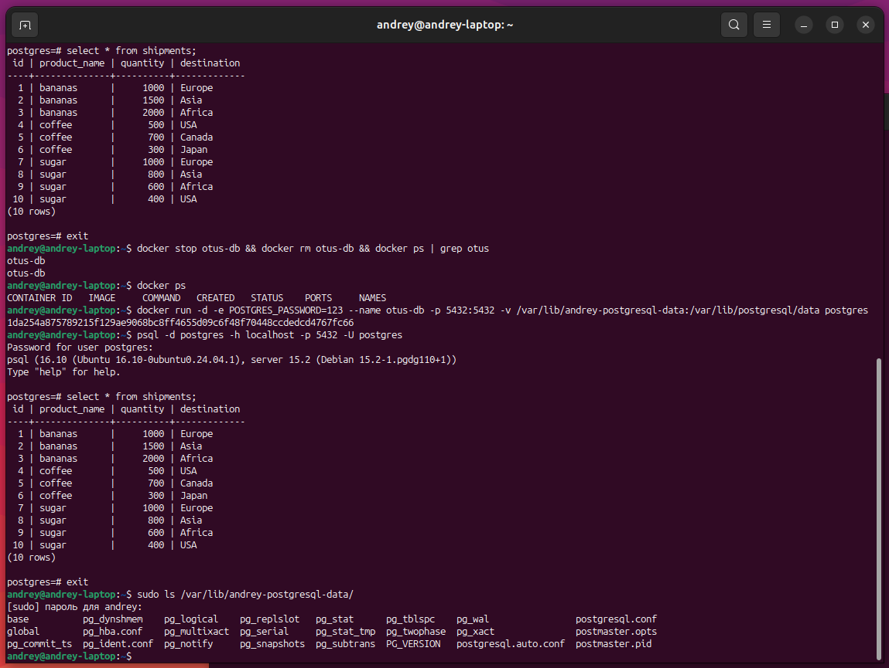

# Домашнее задание №2

### Горшков Андрей, PostgreSQL Advanced, OTUS 2025

### Подготовка:

Создал папку на host-машине для хранения данных с помощью команды:

```
sudo mkdir /var/lib/andrey-postgresql-data
```

### Запуск Docker контейнера:

С помощью команды `docker run`, запустил docker контейнер `otus-db` с PostgreSQL, при этом указал "volume" **/var/lib/andrey-postgresql-data** (через `-v <папка на host-машине>:<папка в docker контейнере>`), для того, чтобы PostgreSQL хранил данные именно в **/var/lib/andrey-postgresql-data** на host-машине, а не в самом контейнере и данные "не потерялись" после того, как я пересоздам контейнер:

```
docker run -d \
    -e POSTGRES_PASSWORD=123 \
    --name otus-db \
    -p 5432:5432 \
    -v /var/lib/andrey-postgresql-data:/var/lib/postgresql/data \
    postgres # по умолчанию используется тэг latest
```

Используя `psql` инициировал сессию с host-машины, создал таблицу `shipments`, добавил в `shipments` данные:



Пересоздал контейнер `otus-db`, используя `psql`, заново инициировал сессию с host-машины и данные "не потерялись", т.к. PostgreSQL, для хранения данных, использовал папку на host-машине, которая была примонтированна, а не сам docker контейнер:



Пример демонстрирует, что docker даёт возможность быстро развернуть PostgreSQL
(для теста различных версий например) и при этом обеспечить сохранность данных.