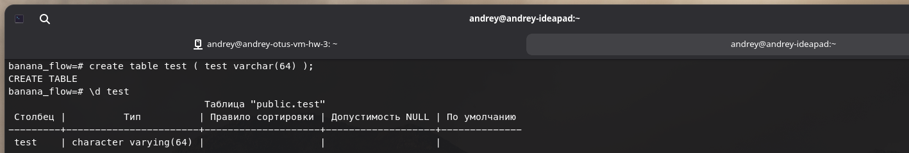

# Домашнее задание №3

### Горшков Андрей, PostgreSQL Advanced, OTUS 2025

### Подготовка:

Создал ВМ с ОС Ubuntu 24.04 на Yandex Cloud (вместе с сетью и подсетью), с именем `andrey-otus-vm-hw-3` и подключился к ней по SSH с host-машины, на созданной ВМ используется 1 физ. диск на 10 ГБ:


Добавил необходимые пакеты с помощью команды:

```
sudo apt update && sudo apt upgrade -y -q && sudo sh -c 'echo "deb http://apt.postgresql.org/pub/repos/apt $(lsb_release -cs)-pgdg main" > /etc/apt/sources.list.d/pgdg.list' && wget --quiet -O - https://www.postgresql.org/media/keys/ACCC4CF8.asc | sudo apt-key add - && sudo apt-get update && sudo apt -y install postgresql && sudo apt install unzip && sudo apt -y install mc
```


### Настройка подключения к PostgreSQL c host-машины, создание БД и таблиц и добавление данных:

Используя `psql` инициировал сессию на ВМ и изменил параметр конфигурации `listen_addresses` на `*`, используя `alter system set`, чтобы к PostgreSQL можно было подключаться не только с localhost-а.

Далее, c помощью `pg_ctlcluster`, перезапустил PostgreSQL, т.к. параметр конфигурации `listen_addresses`, имеет `context` - `postmaster`, который требует перезапуска.

Затем задал пароль для пользователя `postgres`, чтобы использовать его для подключения с host-машины.

Далее изменил `pg_hba.conf`, чтобы можно было подключаться к PostgreSQL с любого IP (маска 0.0.0.0/0):


Затем подключился к PostgreSQL с host-машины, создал БД `banana_flow`, создал таблицу `shipments`, добавил данные:


### Перенос данных на внешний диска:

В UI YandexCloud-а создал внешний диск на 1 Гб и подсоеденил его к ВМ (ОС видит его как `vdb`):


Далее с помощью команды `show data_directory`, посмотрел, где сейчас PostgreSQL хранит данные - `/var/lib/postgresql/18/main`:


Затем примонтировал диск к ВМ, с помощью утилит `mkfs.ext4` и `mount`, точка монтирования - `/mnt/andrey-data`:


Далее с помощью утилиты `rsync` перенес данные из `/var/lib/postgresql/18/main` в `/mnt/andrey-data`:


Затем изменил параметр конфигурации `data_directory`, используя файл `postgresql.conf`, чтобы PostgreSQL начал использовать `/mnt/andrey-data` для хранения данных.

Далее перезапустил PostgreSQL, с помощью`pg_ctlcluster`, т.к. параметр конфигурации `data_directory`, имеет `context` - `postmaster`, который требует перезапуска.

Затем заново подключился к PostgreSQL, чтобы убедиться, что данные на месте:


### Дополнительно

Создал таблицу `test` и cпец. заполнил её большим кол-вом данных, чтобы убедиться, что используется именно внешний диск, который я ранее примонтировал:




Внешний диск был заполнен на 88%:


### Работа над ошибками

Для того, чтобы диск автоматически примонтировался при перезапуске ВМ, после команд `mkfs.ext4` и `mount`, добавил в файл `/etc/fstab` запись о новом диске:


Далее перезапустил ВМ, чтобы убедиться, что диск автоматически примонтировался при перезапуске ВМ:


Затем аналогично шагам ранее, перенес БД на внешний диск, убедился, что данные на месте:


