# Домашнее задание №4

### Горшков Андрей, PostgreSQL Advanced, OTUS 2025

### Подготовка:

Создал 6 ВМ с ОС Ubuntu 24.04 на Yandex Cloud (вместе с сетью и подсетью), 3 под etcd, 3 под patroni:

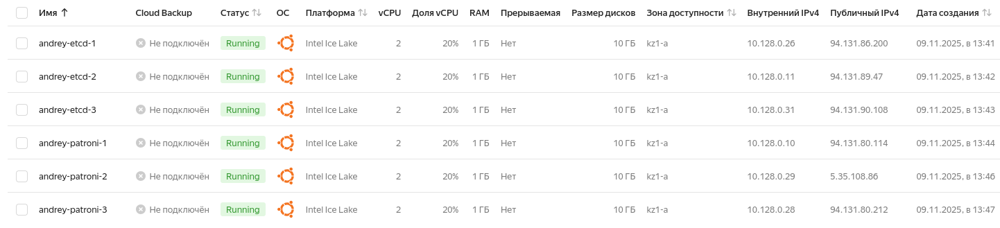

### Настройка кластера etcd:

Т.к. etcd нет в офиц. репозитории Ubuntu 24.04, устанавливал etcd из [GitHub](https://github.com/etcd-io/etcd/releases/):

```
wget https://github.com/etcd-io/etcd/releases/download/v3.5.15/etcd-v3.5.15-linux-amd64.tar.gz
tar -xvf etcd-v3.5.15-linux-amd64.tar.gz
sudo mv etcd-v3.5.15-linux-amd64/etcd* /usr/local/bin/
```

Далее, на ВМ **andrey-etcd-1**, **andrey-etcd-2**, **andrey-etcd-3**, добавил файл `/etc/systemd/system/etcd.service`, для того, чтобы `etcd` запускался как `systemd` служба:

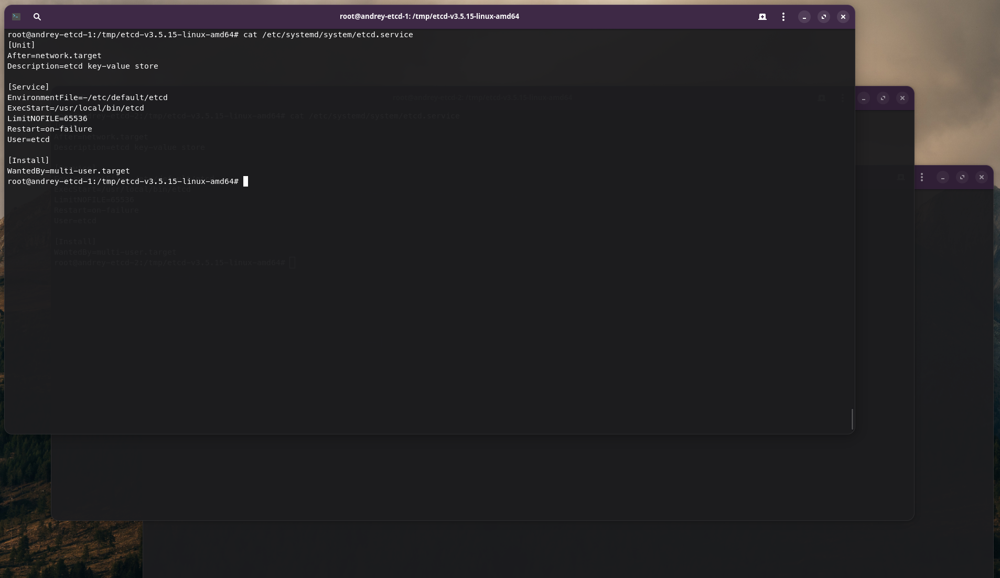

Затем, на ВМ **andrey-etcd-1**, **andrey-etcd-2**, **andrey-etcd-3**, добавил файл `/etc/default/etcd`, для конфигурации `etcd`:

| Имя            | Внутренний IP |
|----------------|---------------|
| andrey-etcd-1  | 10.128.0.26   |
| andrey-etcd-2  | 10.128.0.11   |
| andrey-etcd-3  | 10.128.0.31   |

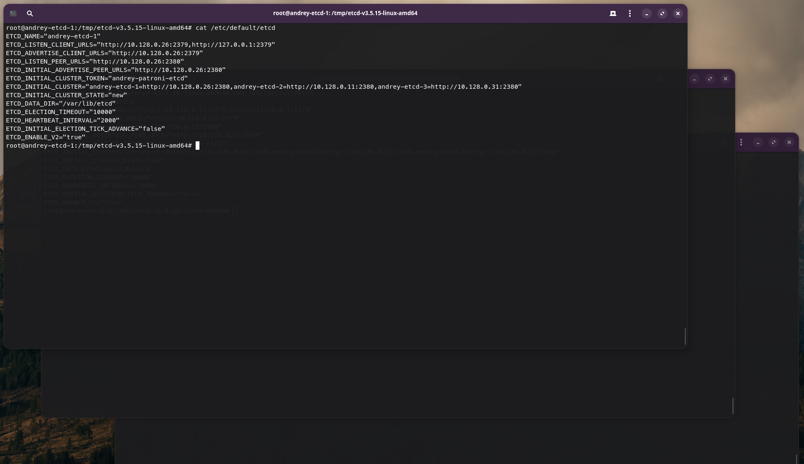

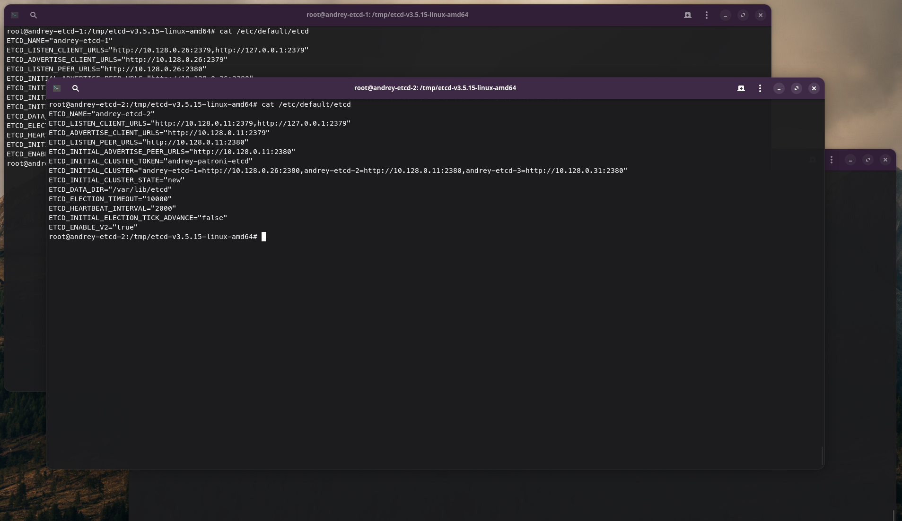

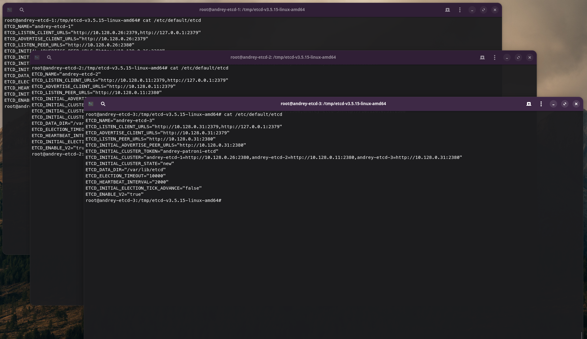

Далее, на ВМ **andrey-etcd-1**, **andrey-etcd-2**, **andrey-etcd-3**, с помощью `systemctl` запустил `etcd` и убедился что `etcd` "живой":

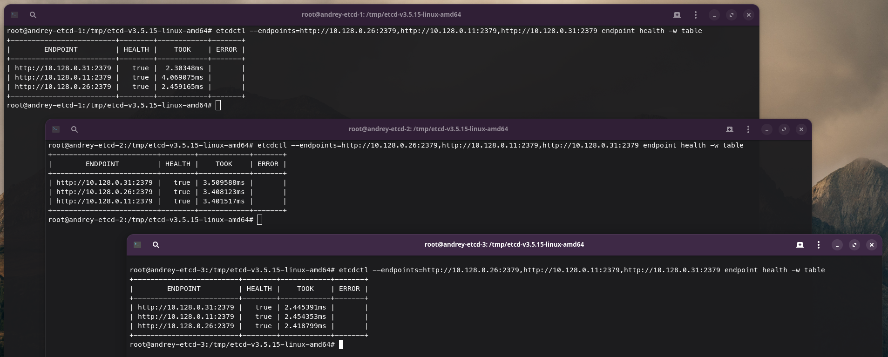

Затем, на ВМ **andrey-etcd-1**, **andrey-etcd-2**, **andrey-etcd-3**, в файле `/etc/default/etcd` изменил параметр `ETCD_INITIAL_CLUSTER_STATE`, с `new` на `existing`, чтобы `etcd` кластер не переинициализировался при перезапуске ВМ:

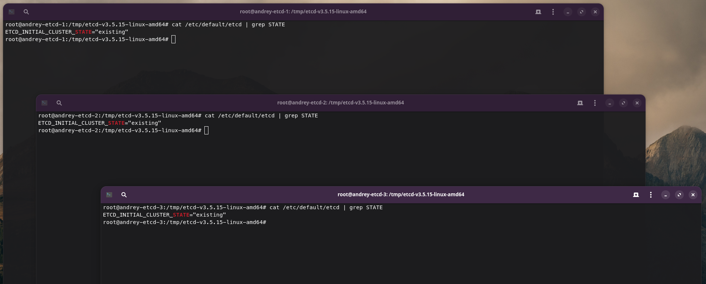

### Настройка patroni:

Далее, на ВМ **andrey-patroni-1**, **andrey-patroni-2**, **andrey-patroni-3**, добавил необходимые пакеты с помощью команды:

```
sudo apt update && sudo apt upgrade -y -q && sudo sh -c 'echo "deb http://apt.postgresql.org/pub/repos/apt $(lsb_release -cs)-pgdg main" > /etc/apt/sources.list.d/pgdg.list' && wget --quiet -O - https://www.postgresql.org/media/keys/ACCC4CF8.asc | sudo apt-key add - && sudo apt-get update && sudo apt -y install postgresql && sudo apt install unzip && sudo apt -y install mc
```

Затем, на ВМ **andrey-patroni-1**, **andrey-patroni-2**, **andrey-patroni-3**, добавил `python3` для работы `patroni`, а также сам `patroni`:

```
apt install python3 python3-pip python3-dev python3-psycopg2 libpq-dev
pip3 install setuptools --break-system-packages \
pip3 install psycopg2 --break-system-packages \
pip3 install psycopg2-binary --break-system-packages \
pip3 install patroni --break-system-packages \
pip3 install python-etcd --break-system-packages \
```

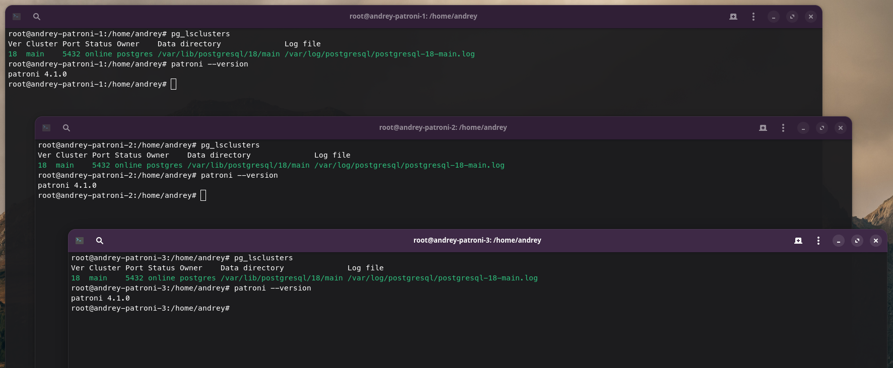

Далее, на ВМ **andrey-patroni-1**, **andrey-patroni-2**, **andrey-patroni-3**, используя `psql` инициировал сессии на ВМ и изменил параметр конфигурации `listen_addresses` на `*`, используя `alter system set`, чтобы к PostgreSQL можно было подключаться не только с localhost-а:

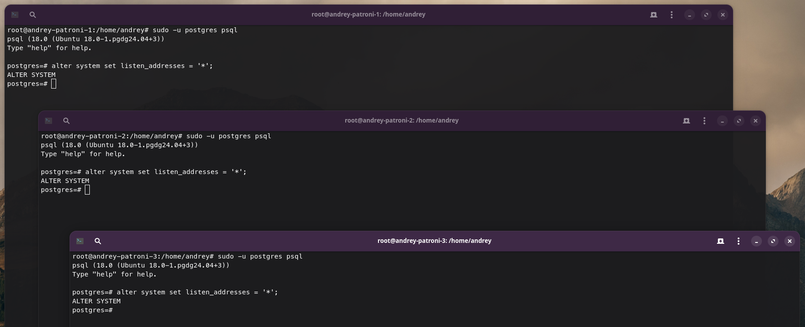

Затем, на ВМ **andrey-patroni-1**, **andrey-patroni-2**, **andrey-patroni-3**, c помощью `pg_ctlcluster`, перезапустил PostgreSQL, т.к. параметр конфигурации `listen_addresses`, имеет `context` - `postmaster`, который требует перезапуска.

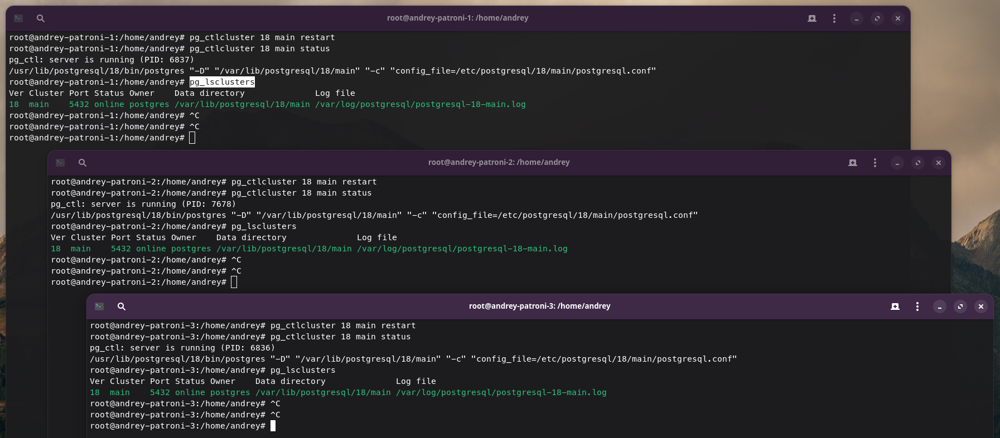

Далее, на ВМ **andrey-patroni-1**, **andrey-patroni-2**, **andrey-patroni-3**, изменил `pg_hba.conf`, чтобы можно было подключаться к PostgreSQL с любого IP (маска 0.0.0.0/0):

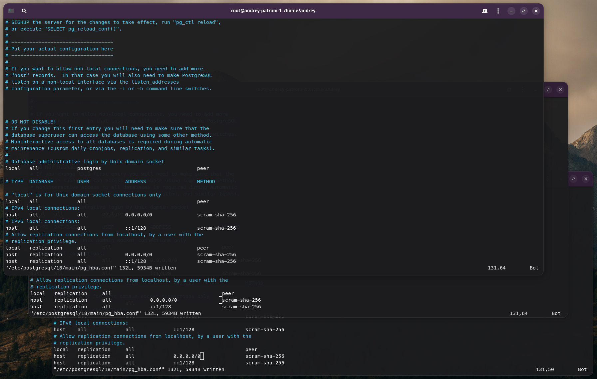

Затем, на ВМ **andrey-patroni-2**, **andrey-patroni-3**, освободил папку `/var/lib/postgresql/18/main`, в которой PostgreSQL хранит данные:

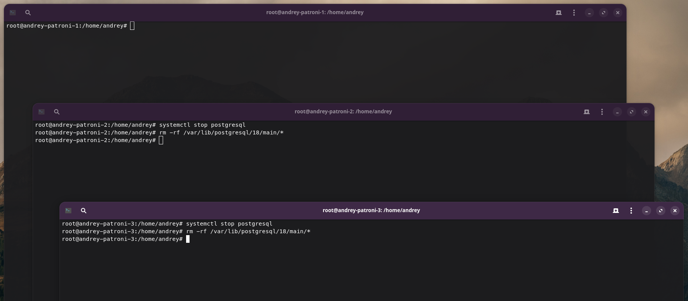

Далее, на ВМ **andrey-patroni-1**, **andrey-patroni-2**, **andrey-patroni-3**, добавил файл `/etc/systemd/system/patroni.service`, для того, чтобы `patroni` запускался как `systemd` служба:

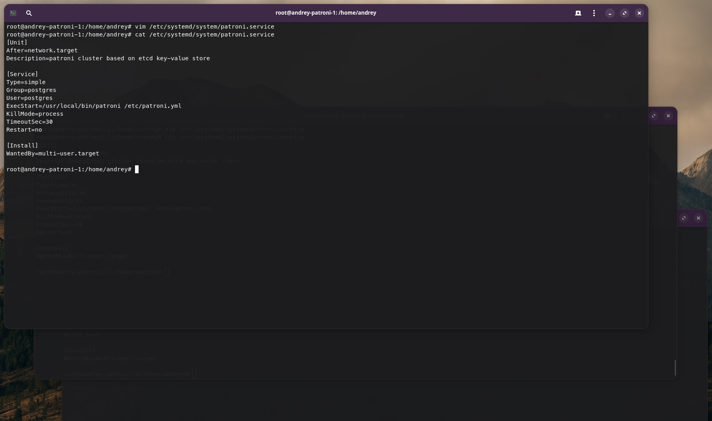

Затем, на ВМ **andrey-patroni-1**, **andrey-patroni-2**, **andrey-patroni-3**, добавил файлы конфигурации `patroni`: [andrey-patroni-1.yml](./configs/andrey-patroni-1.yml), [andrey-patroni-2.yml](./configs/andrey-patroni-2.yml) и [andrey-patroni-3.yml](./configs/andrey-patroni-3.yml), также сделал копию файлов `/etc/postgresql/18/main/postgresql.conf`, `/etc/postgresql/18/main/pg_hba.conf` и `/etc/postgresql/18/main/pg_ident.conf`, т.к. в Ubuntu 24.04 конфигурация разнесена, а `patroni` ожидает её в `data_dir (/var/lib/postgresql/18/main)`, также добавил папку `/var/lib/postgresql/18/main/conf.d` (также, потому что в Ubuntu 24.04 конфигурация разнесена):

```
sudo -u postgres cp /etc/postgresql/18/main/postgresql.conf /var/lib/postgresql/18/main/
sudo -u postgres cp /etc/postgresql/18/main/pg_hba.conf /var/lib/postgresql/18/main/
sudo -u postgres cp /etc/postgresql/18/main/pg_ident.conf /var/lib/postgresql/18/main/
sudo -u postgres mkdir -p /var/lib/postgresql/18/main/conf.d
```

Далее, на ВМ **andrey-patroni-1**, **andrey-patroni-2**, **andrey-patroni-3**, с помощью `systemctl` запустил `patroni` и убедился что `patroni` "живой" (лидер и реплики в порядке):

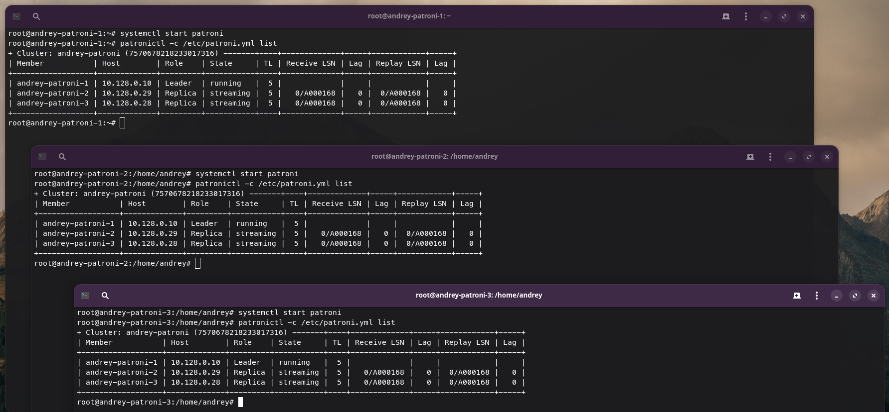

Затем, на ВМ **andrey-patroni-1**, **andrey-patroni-3**, убедился что данные реплицируются с **andrey-patroni-1** на **andrey-patroni-3**:

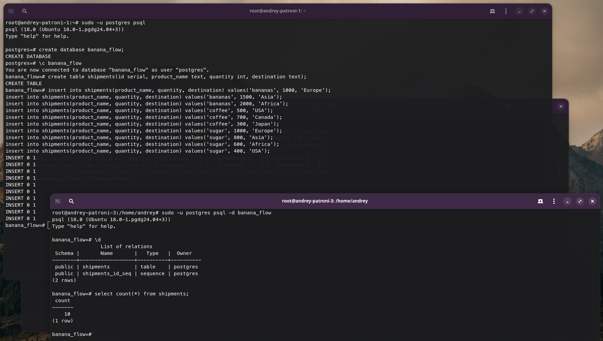

### Настройка haproxy:

Создал ВМ **andrey-haproxy**, добавил пакет `haproxy`.

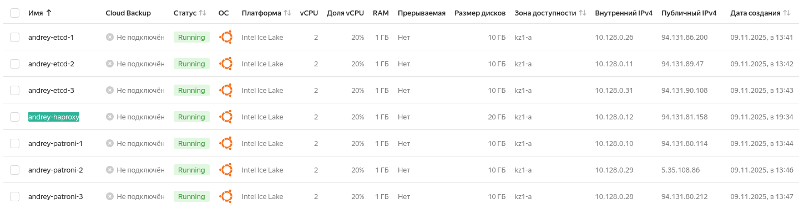

Далее, на ВМ **andrey-haproxy**, с помощью `systemctl` запустил `haproxy`, добавив в конец файла конфигурации параметры из [haproxy.cfg](./configs/haproxy.cfg):

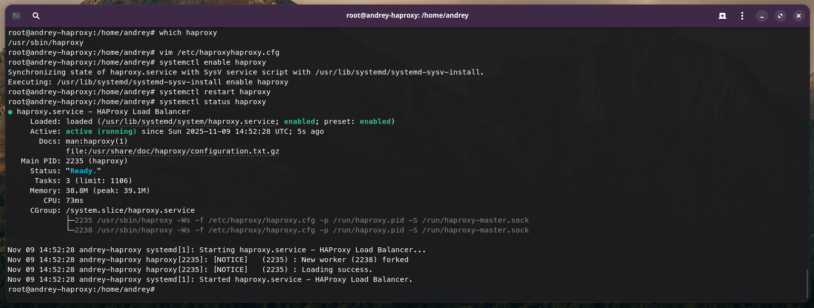

Затем, используя `psql`, c host-машины, инициировал сессии, одну "на запись + чтение" - порт 5431 (`haproxy` перенаправит на лидер) и одну "на запись" - порт 5433 (`haproxy` перенаправит на реплики), убедился что запись работает только на лидере:

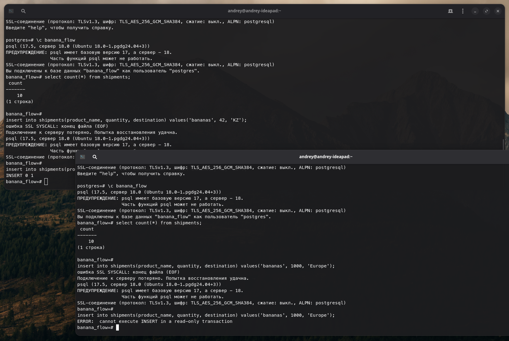

Далее, в Yandex Cloud-е, остановил ВМ **andrey-patroni-1** (лидер), убедился что через некоторое время `patroni` переключил `leader` на **andrey-patroni-2**:

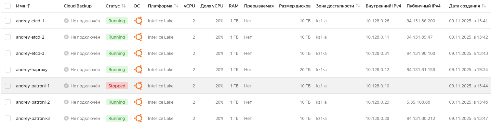

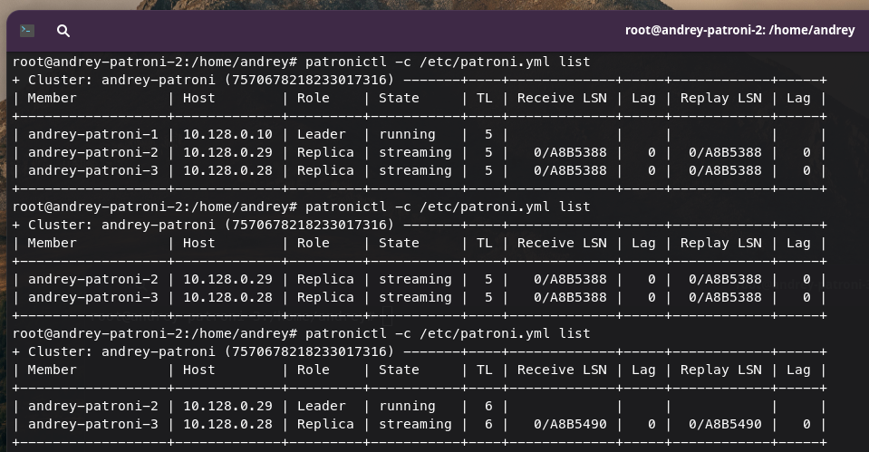

Далее, в Yandex Cloud-е, запустил ВМ **andrey-patroni-1**, убедился что БД заработала, но уже в роли реплики:

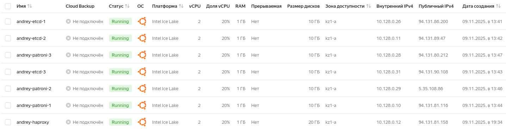

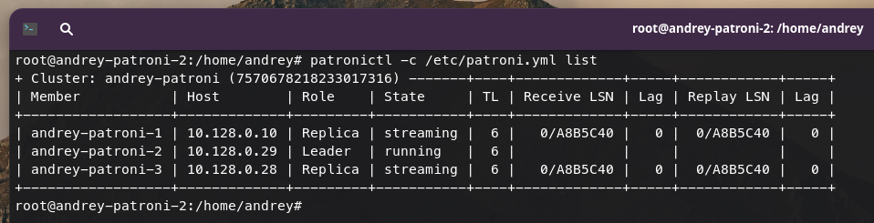

### Дополнительно:

На ВМ **andrey-patroni-2** (лидере в данный момент), создал пользователя `replication_user` и `rewind_user`, с паролем `321`, чтобы не использовать `postgres`, т.к. это "плохая практика" с точки зрения ИБ:

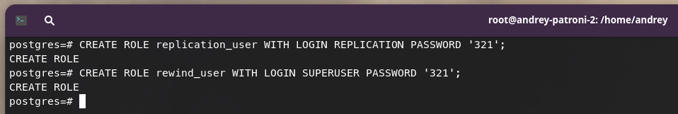

Далее, на ВМ **andrey-patroni-1**, **andrey-patroni-2**, **andrey-patroni-3**, изменил конфигурационный файл `patroni` (`/etc/patroni.yml`) и перезапустил `patroni` c помощью `systemctl`:

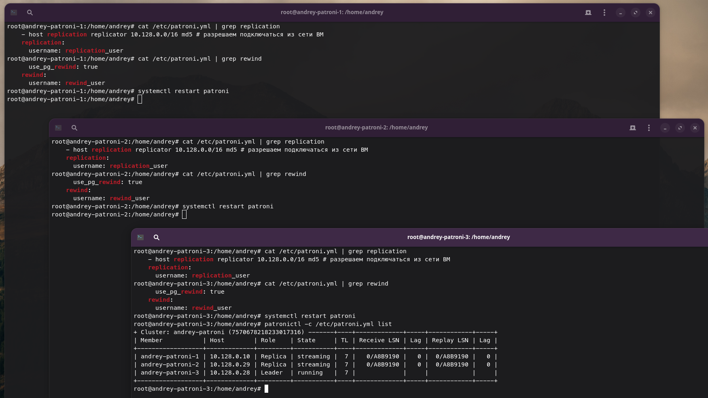

Затем, убедился что данные реплицируются, но уже с **andrey-patroni-3**, на **andrey-patroni-1** и **andrey-patroni-2**, т.к. был перезапуск:

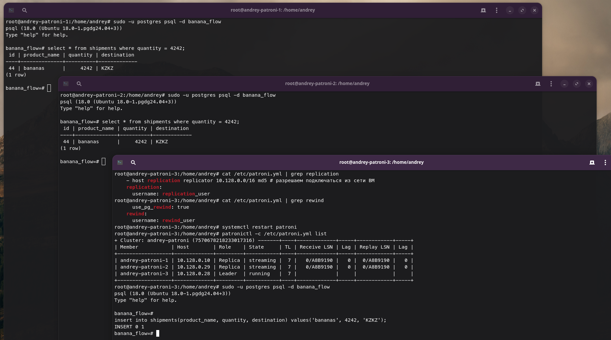
