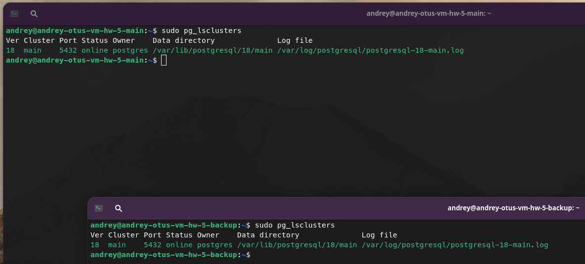
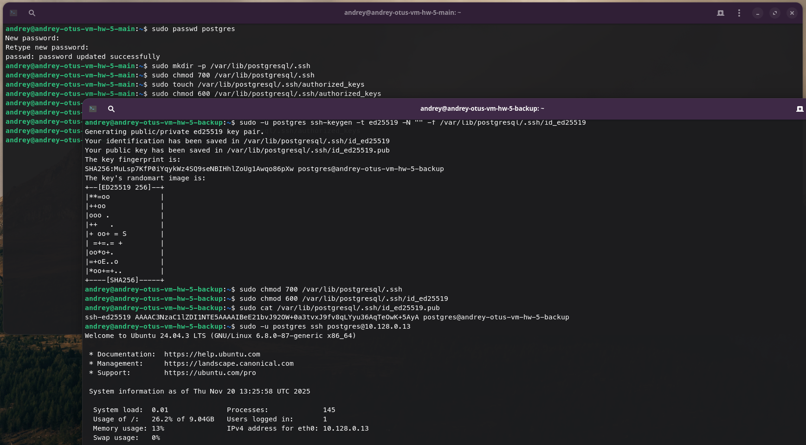
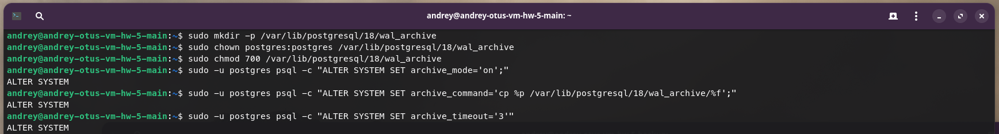
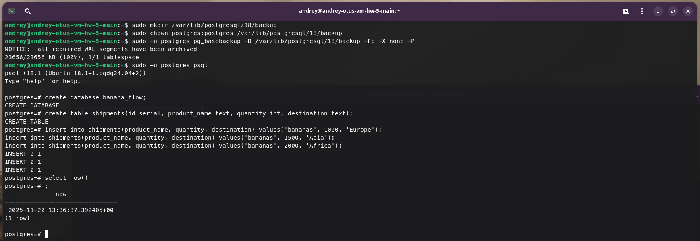
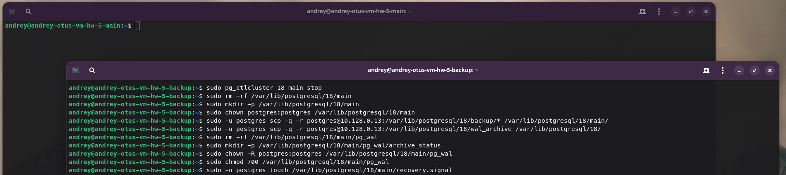
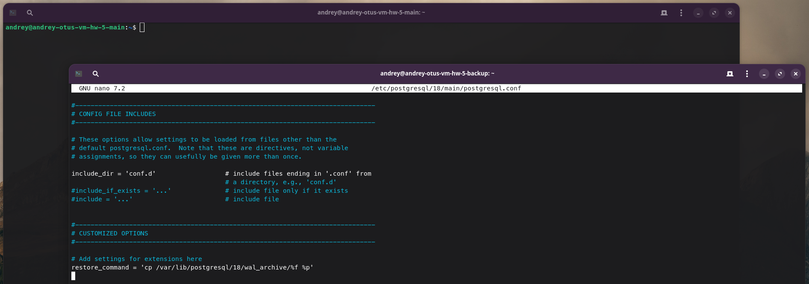
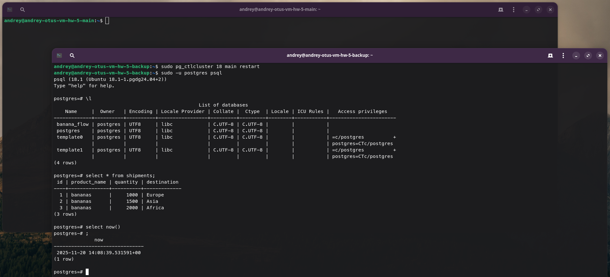

# Домашнее задание №5

### Горшков Андрей, PostgreSQL Advanced, OTUS 2025

### Подготовка:

Создал 2 ВМ с ОС Ubuntu 24.04 на Yandex Cloud (вместе с сетью и подсетью), `andrey-otus-vm-hw-5-main`, `andrey-otus-vm-hw-5-backup`, подключился к ним по SSH с host-машины и добавил необходимые пакеты с помощью команды:

```
sudo apt update && sudo apt upgrade -y -q && sudo sh -c 'echo "deb http://apt.postgresql.org/pub/repos/apt $(lsb_release -cs)-pgdg main" > /etc/apt/sources.list.d/pgdg.list' && wget --quiet -O - https://www.postgresql.org/media/keys/ACCC4CF8.asc | sudo apt-key add - && sudo apt-get update && sudo apt -y install postgresql && sudo apt install unzip && sudo apt -y install mc
```



Далее, добавил доступ по ssh с `andrey-otus-vm-hw-5-backup`, на `andrey-otus-vm-hw-5-main`, для пользователя `postgres`, чтобы в дальнейшем можно было копировать файлы с помощью команды `scp`:



Затем, на ВМ `andrey-otus-vm-hw-5-main`, используя `alter system set`, включил WAL архивирование, чтобы в дальнейшем восстановить данные на кластере `andrey-otus-vm-hw-5-backup`:



Далее, на ВМ `andrey-otus-vm-hw-5-main`, используя `pg_basebackup` сделал бэкап БД в заранее подготовленную директорию, для которой перед этим задал необходимые права. Добавил в БД тестовые данные, чтобы в дальнейшем восстановить их на кластере `andrey-otus-vm-hw-5-backup`:



Затем, на ВМ `andrey-otus-vm-hw-5-backup`, пересоздал директорию с данными, перед этим остановив PostgreSQL, перенёс в неё ранее созданный бэкап БД, с помощью команды `scp` и задал необходимые права. Подобным образом, с помощью команды `scp`, перенёс WAL файлы, а затем создал файл `recovery.signal`, чтобы PostgreSQL запустился в режиме восстановления:



Далее, на ВМ `andrey-otus-vm-hw-5-backup`, в файл `/etc/postgresql/18/main/postgresql.conf` добавил параметр `restore_command`, чтобы указать PostgreSQL, откуда брать WAL файлы в режиме восстановления (`recovery_target_time` не добавлял, чтобы восстановились все данные, что есть):



Затем, на ВМ `andrey-otus-vm-hw-5-backup`, перезапустил кластер, убедился, что данные восстановились:


