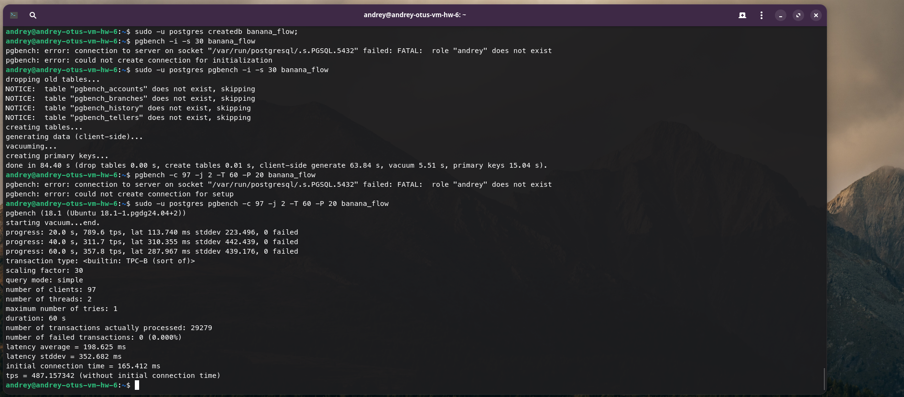
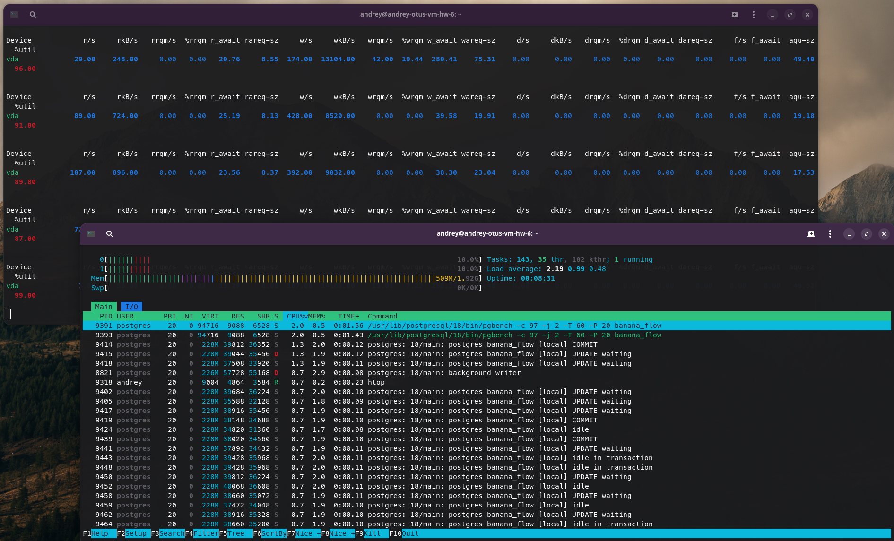
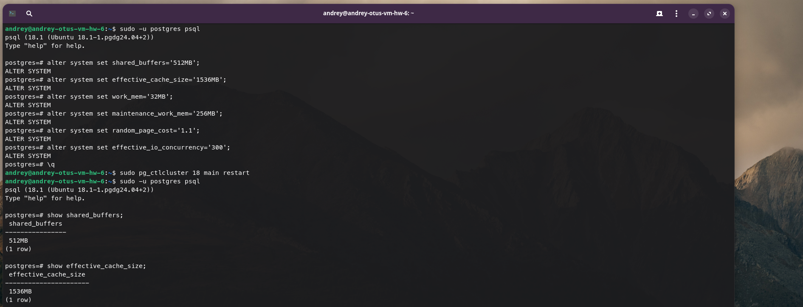
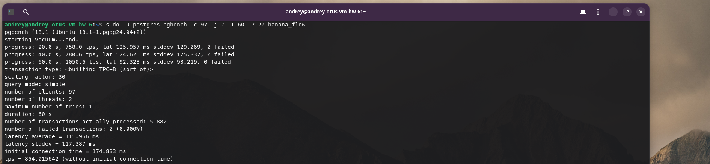
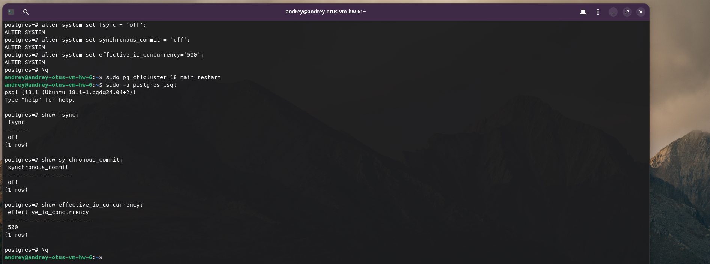
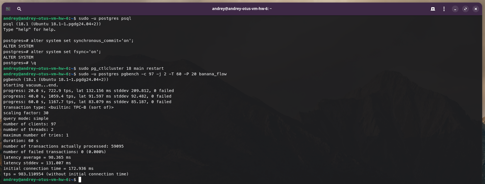

# Домашнее задание №6

### Горшков Андрей, PostgreSQL Advanced, OTUS 2025

### Подготовка:

Создал ВМ `andrey-otus-vm-hw-6`, на Yandex Cloud (вместе с сетью и подсетью), ОС Ubuntu 24.04, аппаратные ресурсы ВМ: 2x CPU, 2 GB RAM, 10 TB SSD. Затем, подключился к ВМ по SSH с host-машины и добавил необходимые пакеты с помощью команды:

```
sudo apt update && sudo apt upgrade -y -q && sudo sh -c 'echo "deb http://apt.postgresql.org/pub/repos/apt $(lsb_release -cs)-pgdg main" > /etc/apt/sources.list.d/pgdg.list' && wget --quiet -O - https://www.postgresql.org/media/keys/ACCC4CF8.asc | sudo apt-key add - && sudo apt-get update && sudo apt -y install postgresql && sudo apt install unzip && sudo apt -y install mc
```

Далее, создал БД `banana_flow` и заполнил БД данными с помощью утилиты `pgbench`. Затем, с помощью `pgbench`, запустил бенчмарк. Использовал 97 соединений (по умолчанию используется 100 - 3 (для суперпользователя)), 2 потока, т.к. процессор 2-х ядерный, бенчмарк длился 60 сек:



Результат:

| TPS (Кол-во транзакций в сек.) | Latency average (Время ответа)                 |
|--------------------------------|------------------------------------------------|
| ~487                           | ~200 ms                                        |

При этом, по нагрузке на аппаратные ресурсы, система упирается в диск. Диск загружен на ~90%, CPU почти не загружен, RAM используется только на 1/4:



С помощью `alter system set`, изменил параметры:

| Имя                      | Описание |
|--------------------------|-----------------------------------------------------------------------------------------------------------------------------------------------------------|
| shared_buffers           | Размер кеша PostgreSQL, уменьшит обращения к диску, за счёт выделения доп. RAM под кеш                                                                    |
| effective_cache_size     | Размер "доступного" кеша PostgreSQL, напрямую на размер кеша не влияет, но влияет на планировщик, также уменьшит обращения к диску                        |
| work_mem                 | Размер выделяемой RAM на 1 запрос, меньше временных файлов, меньше обращений к диску                                                                      |
| maintenance_work_mem     | Размер выделяемой RAM, для операций VACUUM, CREATE INDEX и других операций обслуживания, меньше временных файлов, меньше обращений к диску                |
| random_page_cost         | Определяет, насколько случайное чтение с диска, дороже последовательного чтения с диска, для SSD рекомендуется 1.1                                        |
| effective_io_concurrency | Кол-во параллельных I/O операций, повысит скорость работы с диском, за счёт большого параллельных операций,  для SSD рекомендуется 100+                   |



Затем, с помощью `pgbench`, запустил аналогичный бенчмарк:



Результат:

| TPS (Кол-во транзакций в сек.) | Latency average (Время ответа) |
|--------------------------------|------------------------------------------------|
| ~864                           | ~111 ms                                        |

Кол-во транзакций в сек. выросло почти в 2 раза, время ответа уменьшилось почти в 2 раза, при этом, по нагрузке на аппаратные ресурсы, система стала задействовать CPU уже на ~70%, RAM на 1/2, диск загружен уже на ~70%, а не на ~90%, что говорит о том, что ресурсы теперь распределяются более эффективно:


Далее, с помощью `alter system set`, отключил `fsync` и `synchronous_commit` (гарантированная запись данных на диск, минуя кеш ОС), что даст доп. прирост в производительности, в ущерб стабильности. Также, доп. изменил `effective_io_concurrency`, на ещё большее значение, чтобы ещё больше повысить скорость работы с диском:



Затем, с помощью `pgbench`, запустил аналогичный бенчмарк:


Результат:

| TPS (Кол-во транзакций в сек.) | Latency average (Время ответа) |
|--------------------------------|------------------------------------------------|
| ~1658                          | ~50 ms                                        |

Кол-во транзакций в сек. выросло почти в 4 раза, по сравнению с 1-ым запуском, время ответа уменьшилось почти в 4 раза, по сравнению с 1-ым запуском.

Далее, вновь включил `fsync`, `synchronous_commit` и сделал доп. запуск, `effective_io_concurrency` не изменял, результаты оказались примерно такие же как при 2-ом запуске, доп. измененный `effective_io_concurrency` повлиял не критично, гораздо больше повлияло включение/отключение `fsync`, `synchronous_commit`:


