# Домашнее задание №7

### Горшков Андрей, PostgreSQL Advanced, OTUS 2025

### Подготовка:

Установил minikube, kubectl и heml, с помощью команд:

```
curl -LO https://github.com/kubernetes/minikube/releases/latest/download/minikube-linux-amd64
sudo install minikube-linux-amd64 /usr/local/bin/minikube && rm minikube-linux-amd64
sudo pacman -S kubectl
sudo pacman -S heml
```

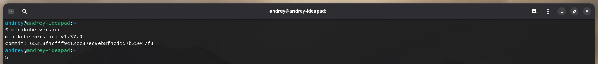

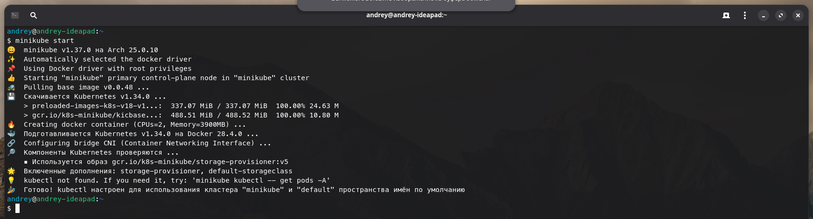

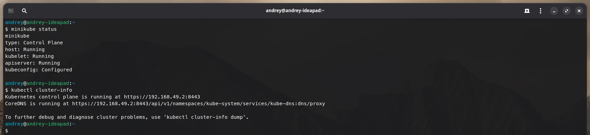

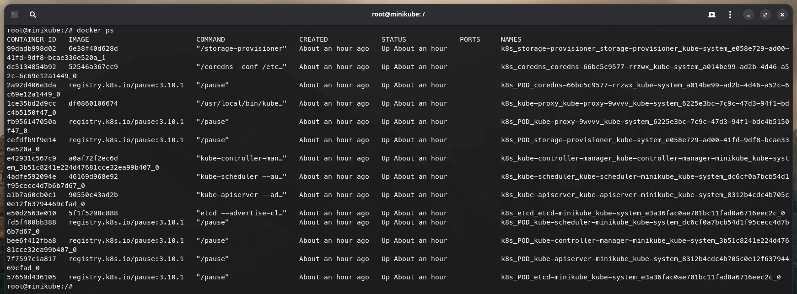

Далее, создал файл [postgres-secret.yml](./configs/postgres-secret.yml) (Secret), для хранения пароля. Добавил в файл пароль суперпользователя (**POSTGRES_PASSWORD**), закодированный в base64, с помощью команды `echo -n '123' | base64`:

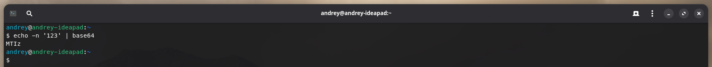

Затем, создал файл [postgres-config.yml](./configs/postgres-config.yml) (ConfigMap), для хранения конфигурации PostgreSQL. Добавил в файл имя суперпользователя (**POSTGRES_USER**) и имя принадлежащей ему БД (**POSTGRES_DB**).

Далее, создал файл [postgres-service.yml](./configs/postgres-service.yml) (Service), для доступа к PostgreSQL в Kubernetes кластере. При этом, используемый далее, StatefulSet, требует указать `clusterIP: None`, чтобы обращаться к конкретному Pod-у через его DNS-имя, а не через виртуальный IP.

Затем, создал файл [postgres-sts.yml](./configs/postgres-sts.yml) (StatefulSet) для запуска непосредственно PostgreSQL Pod-а.

Далее, с помощью команды `kubectl apply -f <папка с конфигурацией>`, запустил Kubernetes кластер. Затем c помощью команды `kubectl post-forward`, пробросил порт 5432 на host-машину и подключился с к БД с помощью `psql` и добавил тестовые данные:

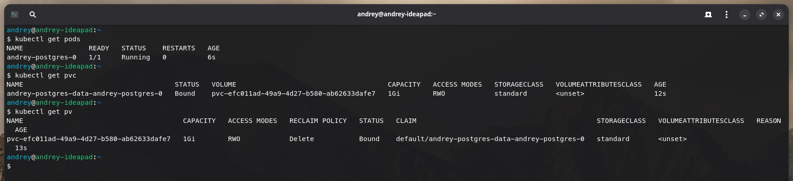

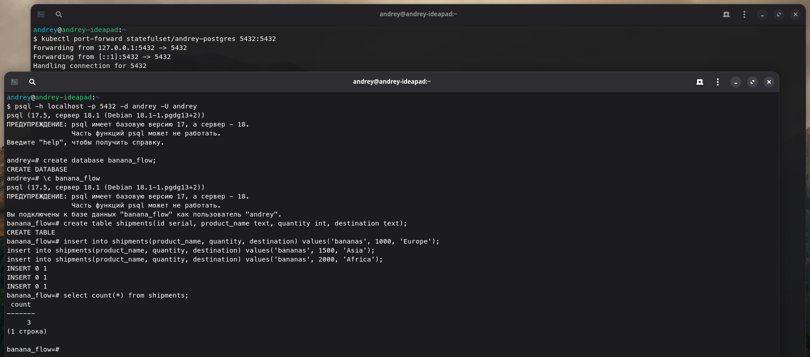

Затем, с помощью команды `kubctl delete pod`, удалил PostgreSQL Pod, чтобы убедится, что после пересоздания, данные не "потеряются", за счёт связанного с Pod-ом PVC и PV:

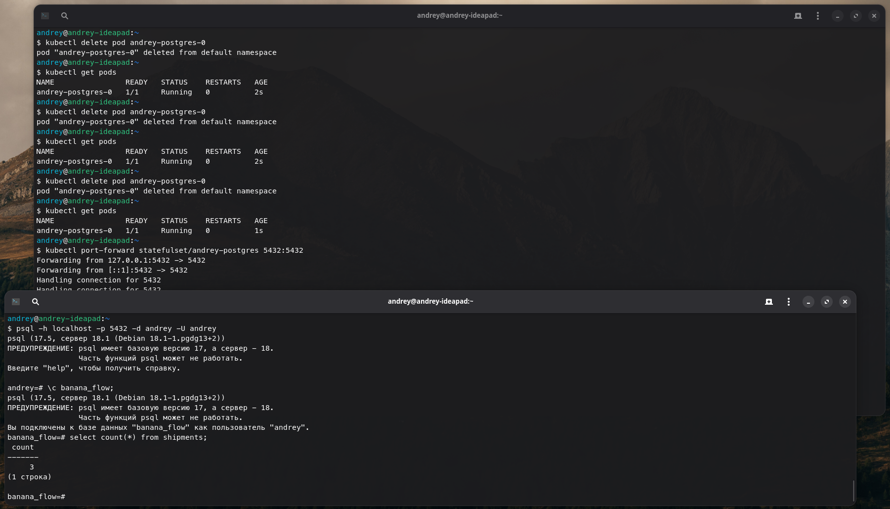

Далее, создал файл [pg-values.yml](./configs/pg-values.yml) и с помощью helm поднял доп. Kubernetes кластер с PostgreSQL, в котором уже 3 Pod-а PostgreSQL - 1 master + 2 replica (использовал helm чарт от bitnami):

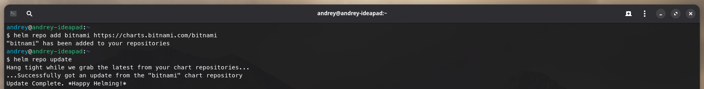

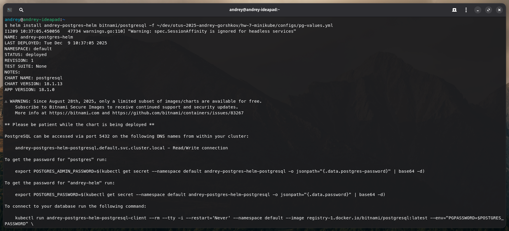

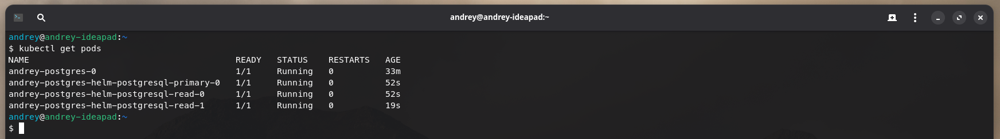

Затем, убедился что кластер работает, добавил данные на master, убедился что данные есть на replica (аналогично c помощью команды `kubectl post-forward`, пробросил порт 5432/5433 на host-машину и подключился с к БД с помощью `psql`):

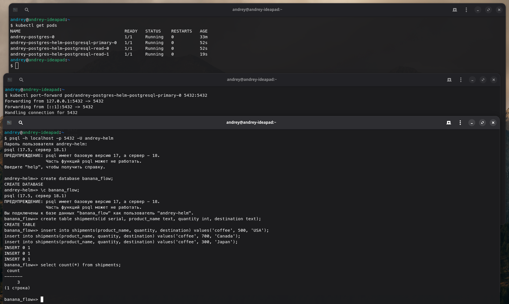


