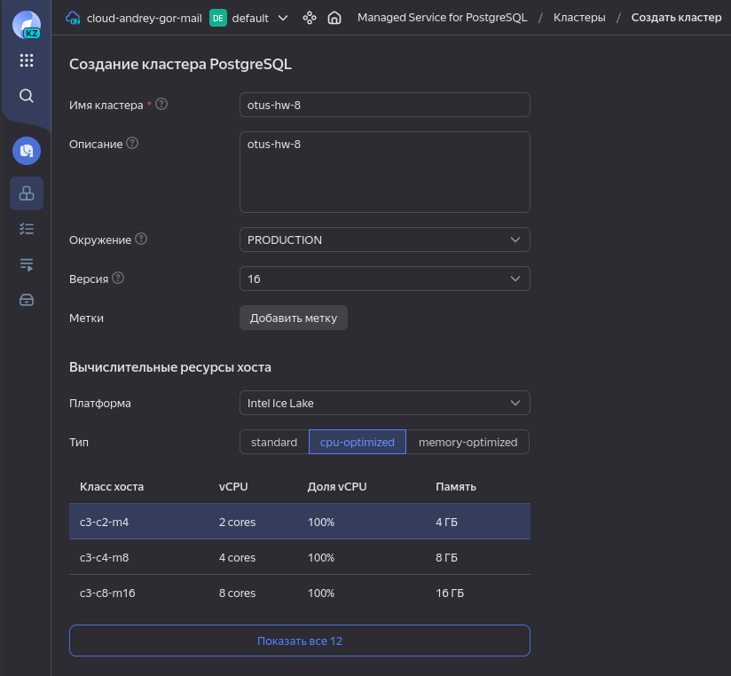
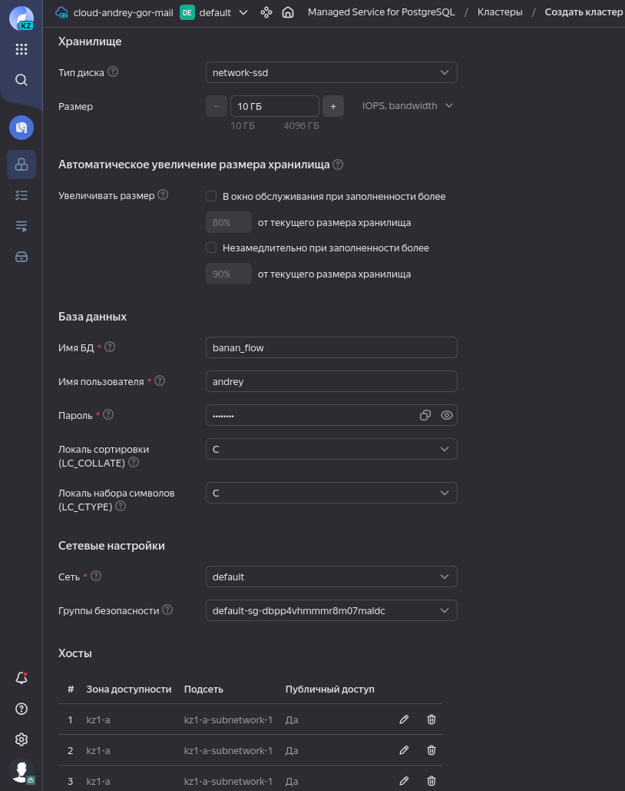
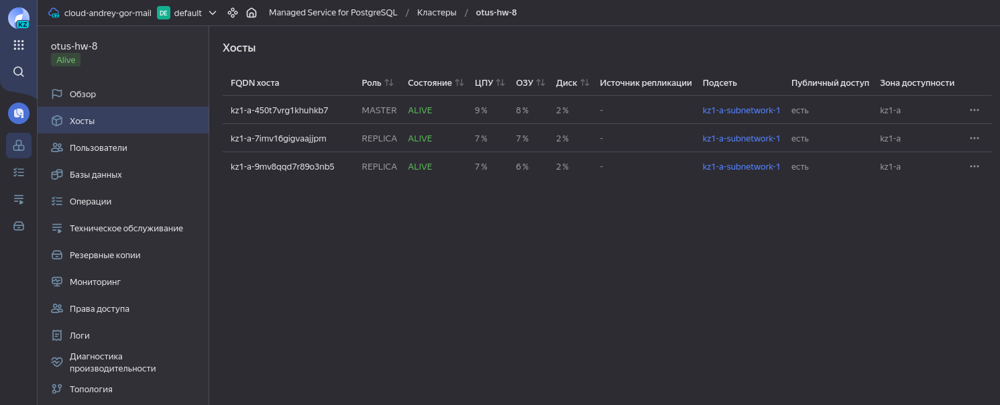
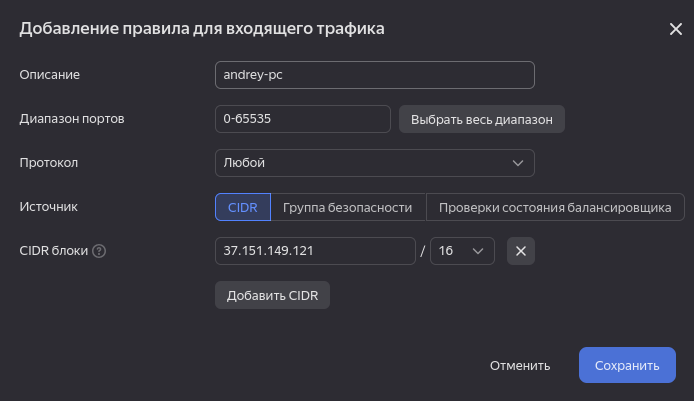
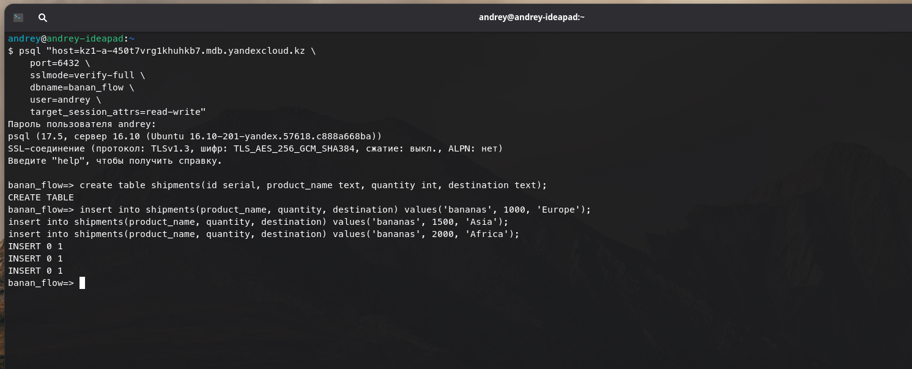
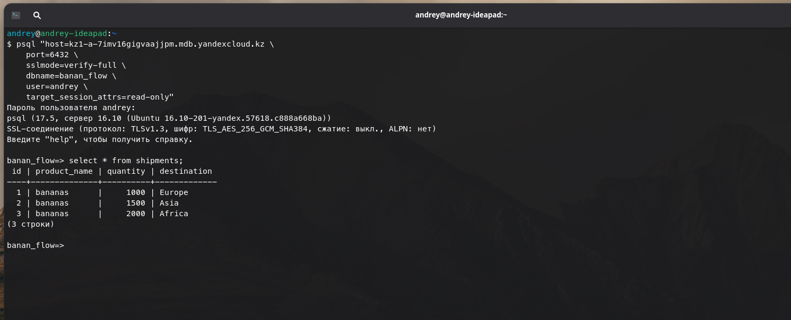

# Домашнее задание №8

### Горшков Андрей, PostgreSQL Advanced, OTUS 2025

### Подготовка:

Через UI Yandex Cloud, создал **Managed Service For PostgreSQL** ресурс:

1. Имя кластера - `otus-hw-8`
2. Версия PostgreSQL - **16**
3. Ресурсы - 2 cores CPU, 4 GB RAM (1 cores CPU, 1 GB RAM Yandex Cloud создать не даёт)
4. Диск - 10 GB SSD
5. Имя БД - `banana_flow`
6. Имя суперпользователя - `andrey`
7. Создал три хоста, в зоне доступности kz1-a (в другой зоне доступности Yandex Cloud создать хост не даёт, видимо из-за того, что в КЗ)







Далее, добавил правила группы безопасности, по которым, подключаться к кластеру можно только с моего ПК (указал свой публичный IP):




Затем, подключился к кластеру через `psql` (`master` хост, в режиме `read-write`) и добавил данные: 



Использовал команду:

```
psql "host=kz1-a-450t7vrg1khuhkb7.mdb.yandexcloud.kz \
    port=6432 \
    sslmode=verify-full \
    dbname=banan_flow \
    user=andrey \
    target_session_attrs=read-write"
```

Далее, ещё раз подключился к кластеру через `psql` (`replica` хост, в режиме `read-only`) и убедился что данные реплицировались и доступны:



Использовал команду:

```
psql "host=kz1-a-7imv16gigvaajjpm.mdb.yandexcloud.kz \
    port=6432 \
    sslmode=verify-full \
    dbname=banan_flow \
    user=andrey \
    target_session_attrs=read-write"
```
