# Домашнее задание №9

### Горшков Андрей, PostgreSQL Advanced, OTUS 2025

### Подготовка:

Через UI Yandex Cloud, создал **Managed Service For PostgreSQL** ресурс:

1. Имя кластера - `otus-hw-9-ycloud`
2. Версия PostgreSQL - **16**
3. Ресурсы - 2 cores CPU, 4 GB RAM (1 cores CPU, 1 GB RAM Yandex Cloud создать не даёт)
4. Диск - 10 GB SSD
5. Имя БД - `banana_flow_ycloud`
6. Имя суперпользователя - `andrey_ycloud`
7. Создал 3 хоста, в зоне доступности kz1-a (в другой зоне доступности Yandex Cloud создать хост не даёт, видимо из-за того, что в КЗ)

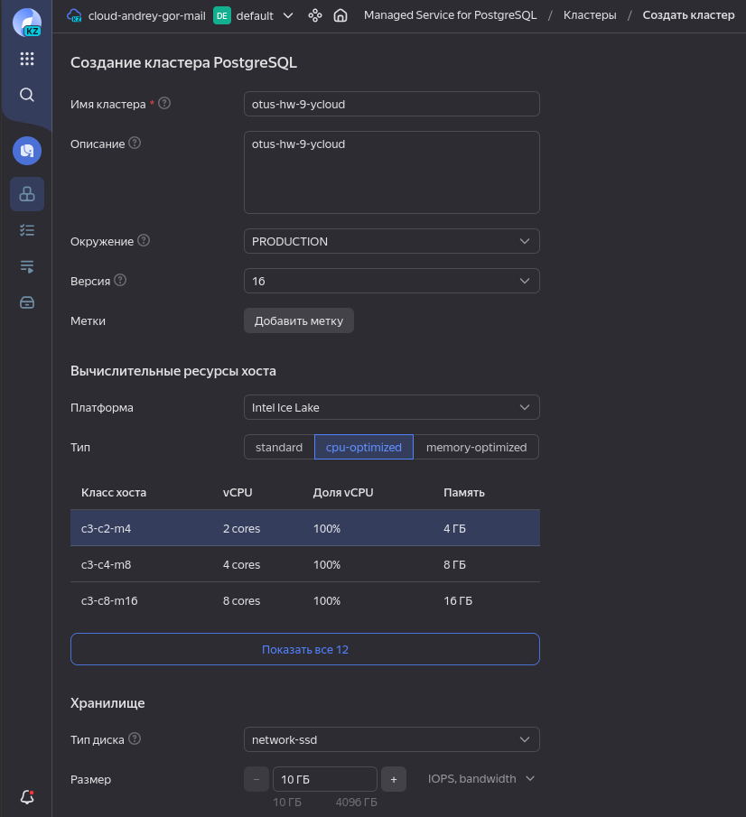

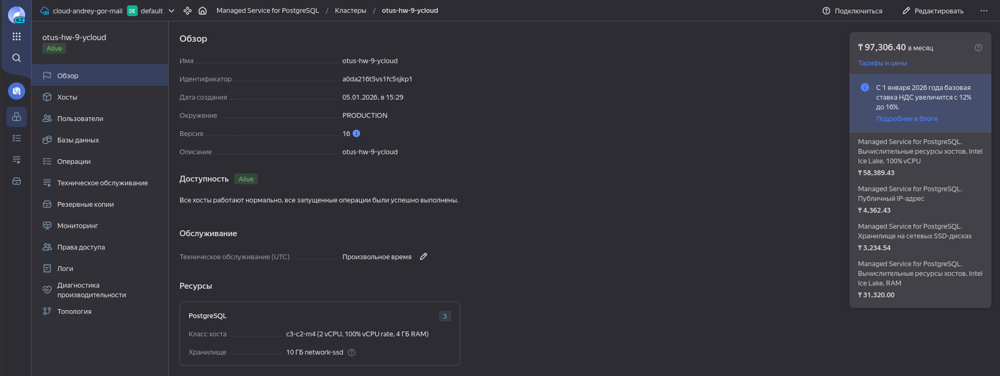

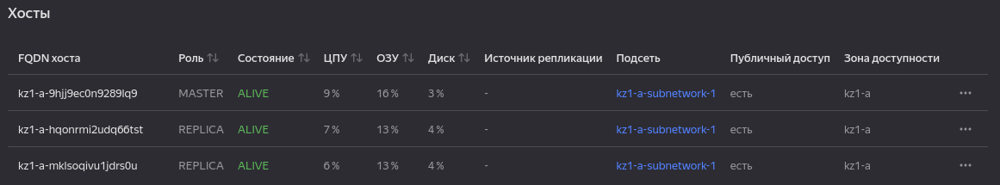

Расчётная стоимость в месяц: **97,300 тенге (191,38 $)**

Затем, через UI VK Cloud, создал **Кластер PostgreSQL 16** ресурс:

1. Имя кластера - `otus-hw-9-vkcloud`
2. Версия PostgreSQL - **16**
3. Ресурсы - 2 cores CPU, 8 GB RAM (1 cores CPU, 1 GB RAM Yandex Cloud создать не даёт)
4. Диск - 10 GB SSD
5. Имя БД - `banana_flow_vkcloud`
6. Имя суперпользователя - `andrey_vkcloud`
7. Создал 3 хоста, в зоне доступности QAZ-a (в другой зоне доступности VK Cloud создать хост не даёт, видимо из-за того, что в КЗ)

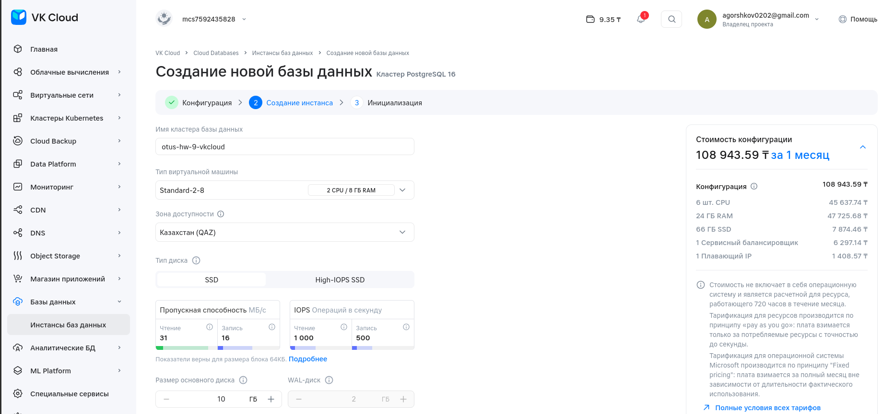

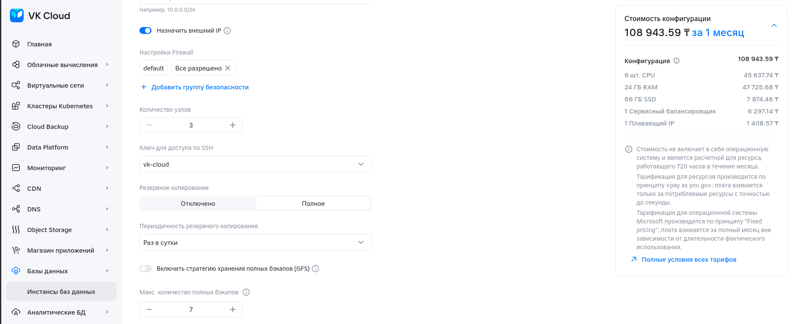

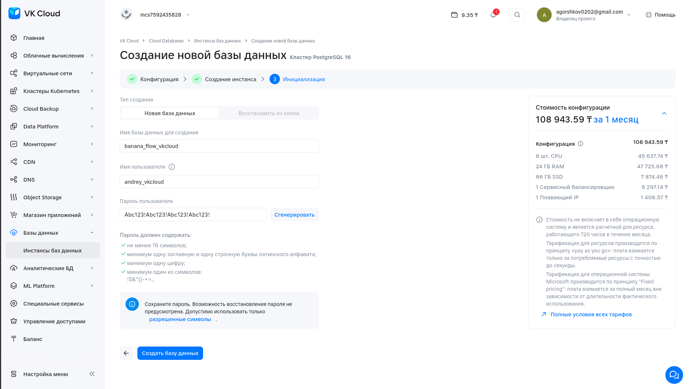

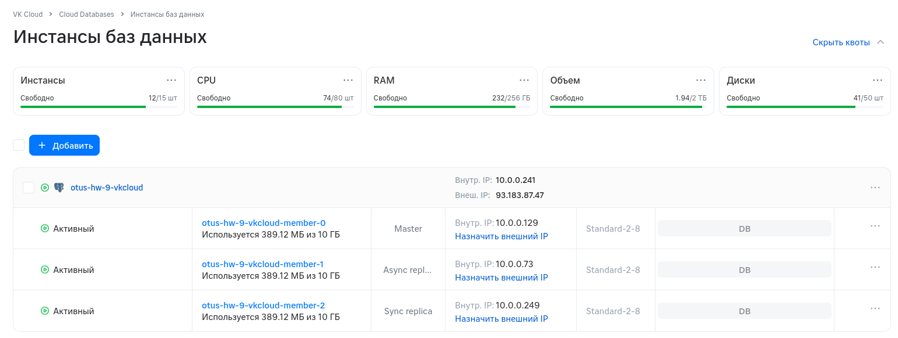

Расчётная стоимость в месяц: **108,943 тенге (214,28 $)**

Для каждого кластера настроено резервное копирование, бэкап будет хранится 7 д.

Далее, каждому кластеру добавил правила группы безопасности, по которым, подключаться к кластеру можно только с моего ПК (указал свой публичный IP):

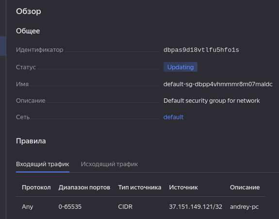

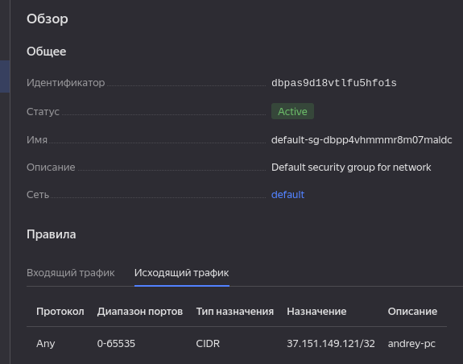

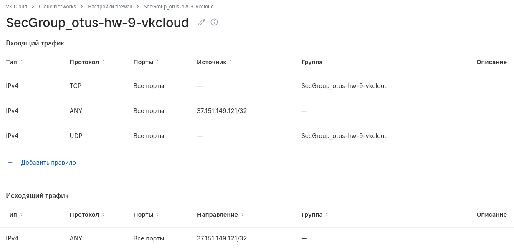

Затем, подключился к каждому кластеру через `psql` и добавил данные:

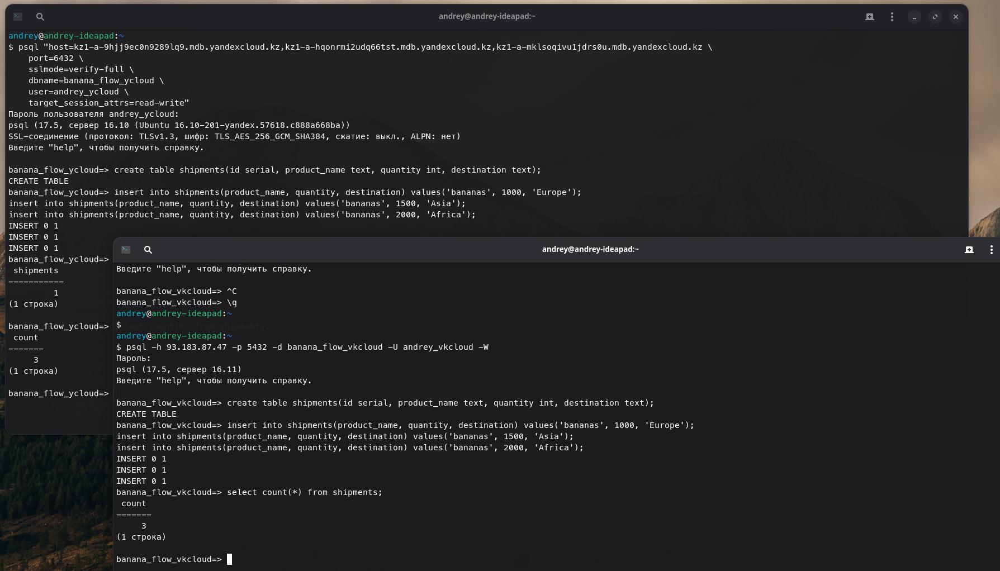

Каждый кластер в рабочем состоянии.

Далее, с помощью команды `docker run -d -e POSTGRES_PASSWORD=123 --name postgres-bench postgres:16`, локально создал контейнер с PostgreSQL 16 и запустил в нём `pgbench` для каждого кластера по очереди (через контейнер, чтобы не устанавливать PostgreSQL локально):

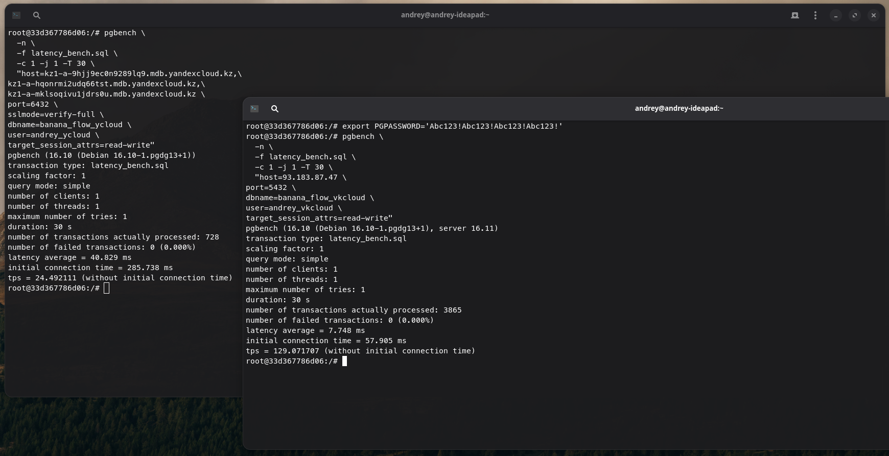

Бенчмарк показал, что при конфигурации минимальных аппаратных ресурсов latency кластера VK Cloud существенно меньше, чем у Yandex Cloud (~7 ms vs ~40 ms). С другой стороны, Yandex Cloud более «гибкий» и даёт возможность выбрать менее «дорогой» набор аппаратных ресурсов. Также Yandex Cloud показался мне более удобным.

При одинаковой конфигурации аппаратных ресурсов Yandex Cloud будет дороже на **30$ (124 000 тенге (240$))**. Соответственно, VK Cloud кажется более доступным, но с другой стороны, Yandex Cloud более гибкий и удобный в настройке, а также имеет более обширную документацию. Не стоит сбрасывать со счетов и репутацию компаний: опять же, на мой взгляд, Yandex вызывает больше доверия.

Вывод: для менее крупных проектов, которым важнее быстрый и недорогой старт, я бы выбрал VK Cloud как более доступное решение. Для более крупных проектов, я бы выбрал Yandex Cloud как более гибкое и проработанное решение.
